# Introduction

The creation of formal employment remains one of Indonesia's key economic development challenges. Statistics Indonesia (BPS) data show that although the open unemployment rate declined from 4.91 percent in August 2024 to 4.85 percent in August 2025, informal employment has continued to grow faster than formal employment. At the same time, the proportion of full-time workers has shown a declining trend in recent years [@bps2025tpt; @lubis2025]. These developments suggest that labor market performance should be assessed not only in terms of the number of jobs created, but also in terms of the quality and formality of employment opportunities.

Within this context, the textile & garment, and footwear industries occupy a strategic position in Indonesia's economy. In 2025, the two industries employed more than five million workers, equivalent to approximately one-quarter of Indonesia's formal manufacturing workforce. Their contribution to employment is disproportionately larger than their contribution to manufacturing output, reflecting the labor-intensive nature of their production processes. Based on BPS data, the industries also generate significantly more employment per unit of investment than most other manufacturing sectors. As a result, developments in the textile and footwear industries have direct implications for formal job creation, household incomes, and broader economic inclusion.

At the same time, the industries face a complex set of challenges. In recent years, textile and footwear producers have been affected by slowing global demand, intensifying international competition, increasingly stringent sustainability requirements in major export markets, and the need for continued technological upgrading and productivity improvements. These pressures have been reflected in factory closures and layoffs reported since 2023. Yet despite these challenges, the industries continue to attract new investment, particularly from firms integrated into global value chains and supplying international brands. This apparent contradiction suggests that the challenges facing the sector cannot be understood solely as a question of declining competitiveness. Rather, they reflect an ongoing process of industrial transformation that is reshaping Indonesia's textile and footwear industries.

This paper examines these dynamics in greater detail. Section 2 reviews the characteristics of Indonesia's textile and footwear industries, including their value chain structures, investment patterns, trade linkages, and industrial heterogeneity. Section 3 discusses the key strategic issues affecting industry competitiveness, including international trade, sustainability and traceability requirements, technological modernization, and workforce readiness. Section 4 reviews government policies and support programs relevant to the development of the sector. Section 5 concludes.

# Characteristics of the Textile & Garments and Footwear Industries

## General Overview

@fig-growth shows quarterly value added growth of textile and garment as well as leather and footwear Industries, compared with non oil and gas manufacturing as well as the general economic growth. Indonesia's textile and garment industry grew by 3.55% in 2025, compared with 4.26% in 2024. The leather, leather products and footwear industry recorded growth of 3.31 percent in 2025, following a notably stronger expansion of 6.83 percent in 2024. Despite the moderation observed in 2025, the footwear industry has generally outperformed the textile industry during the post-pandemic recovery period. More broadly, both industries have exhibited significant volatility over the past decade, reflecting shifts in global demand and the disruptions associated with the COVID-19 pandemic.

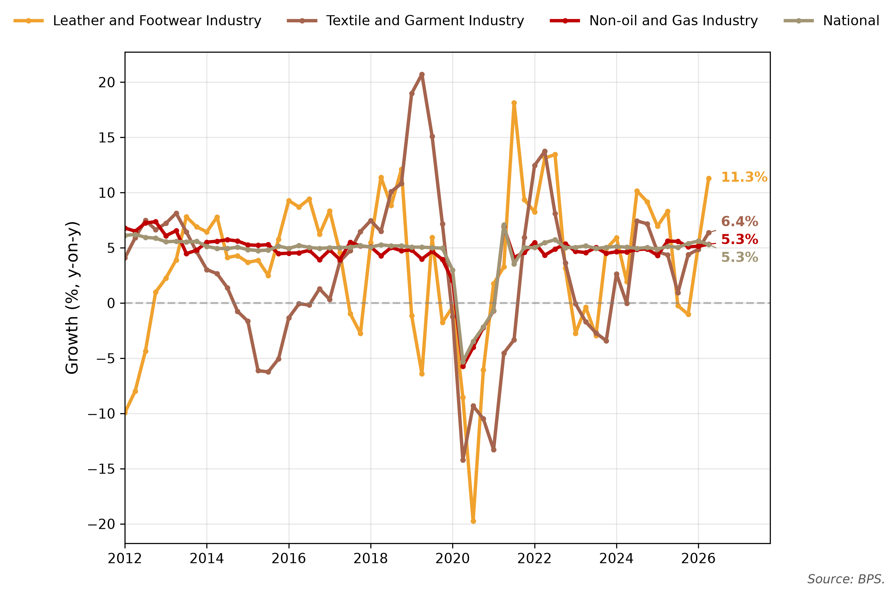{#fig-growth width=85%}

As @fig-recovery demonstrates, more than four years after the onset of the pandemic, the two industries experience quite a different story. The figure presents constant-price GDP for the textile & garment and the footwear industries. The solid, orange line represents actual GDP data, while the dashed line indicates the pre-COVID trend estimated using the HP filter method [@hodrick1997; @razzak1997]. Footwear industries seem to able to return to its longer-term growth path. Textile and garment, however, remains struggling to catch up to its pre-COVID trajectory.

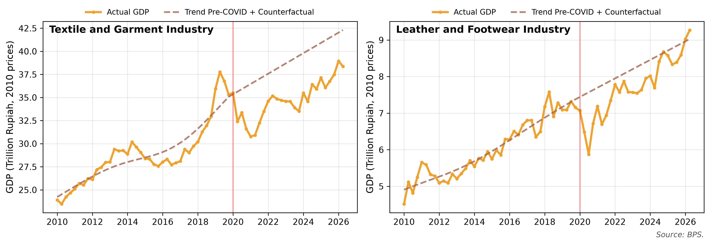{#fig-recovery width=100%}

Direct investment in both industries has increased substantially since the COVID-19 pandemic, reaching their highest levels during 2021--2025 (@fig-investment). However, the two industries exhibit markedly different investment structures. The textile and garment industry draws from a relatively broader investment base, with domestic investors accounting for between 19 and 61 percent of total realized investment during 2010--2025. In contrast, the footwear industry remains heavily dependent on foreign direct investment (FDI), with foreign investors consistently contributing around 90 percent or more of total investment throughout most of the period.

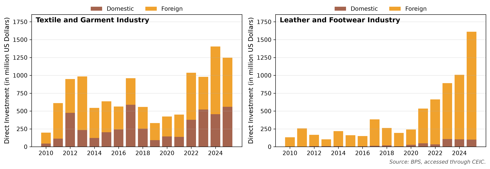{#fig-investment width=100%}

Investment growth has been particularly pronounced in the footwear industry. Between 2020 and 2025, total realized investment increased from approximately USD 241 million to more than USD 1.6 billion. Over the same period, investment in the textile and garment industry rose from around USD 424 million to USD 1.25 billion. As a result, by 2025 the footwear industry attracted higher levels of investment than the textile and garment industry despite being considerably smaller in terms of output. The predominance of foreign investment in the footwear industry is consistent with its strong participation in export-oriented production networks, while the textile and garment industry continues to benefit from a more diversified mix of domestic and foreign investment.

These industries' importance is also reflected in their export performance. In 2025, Indonesia's textile and garment industry recorded export values of USD 11.98 billion and generated a trade surplus of USD 2.81 billion. Export values declined slightly by 0.6 percent (yoy), compared with growth of 3.1 percent in 2024.

In contrast, the footwear industry continued to record strong export performance. Footwear exports reached USD 7.98 billion in 2025, increasing by 9.54 percent (yoy), compared with growth of 13.13 percent in 2024. With imports amounting to approximately USD 1.32 billion, the industry maintained a substantial trade surplus. These figures underscore the continued importance of both industries as sources of export earnings, while highlighting the stronger export momentum currently observed in the footwear industry.

International trade plays a particularly important role in both the textile and footwear industries. Using the Asian Development Bank's Multi-Regional Input-Output (MRIO) Tables [@adb2025mrio], it can be estimated that approximately 41.88 percent of output from the textile industry is ultimately allocated to export markets, while the corresponding figure for the footwear industry reaches 92.81 percent. Imported inputs also remain a critical component of production. Based on estimates derived from the same MRIO framework, the value of foreign-sourced goods and services accounts for approximately 72.88 percent of total intermediate inputs used in the textile industry and 84.23 percent in the footwear industry. These figures highlight the extent to which both industries are integrated into regional and global production networks, both as exporters and as users of internationally sourced inputs.

The United States and the European Union remain the two most important markets for global textile and footwear finished goods. Together, they accounted for approximately 64.2 percent of global imports of products under HS Chapters 61--64 in 2025, which mainly consist of apparel, made-up textile articles, and footwear (@fig-globalimport). The European Union is the world's largest importer of these products, accounting for 47.1 percent of total global imports, followed by the United States at 17.1 percent.

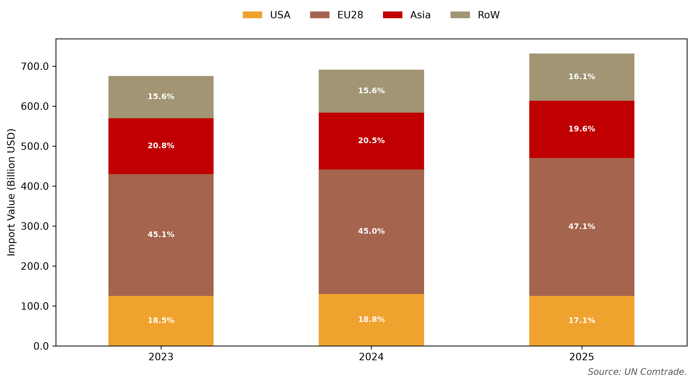{#fig-globalimport width=85%}

Beyond its role as a major export market, the European Union also plays an important role in shaping global production standards through regulatory initiatives such as the Ecodesign for Sustainable Products Regulation (ESPR) [@ec2024espr; @yan2025]. Consequently, sustainability and traceability requirements are becoming increasingly important for Indonesian textile and footwear exporters seeking access to the European market.

@tbl-shares illustrates how competition in these export markets has evolved over the past decade. Between 2015 and 2024, China's share of textile and footwear imports declined substantially in both the United States and the European Union. In the United States, China's market share fell from 44.00% to 29.22%, while in the European Union, it declined from 39.09% to 30.70%. The largest beneficiaries of this shift were Vietnam and Bangladesh, with both countries experiencing notable gains in market share. Indonesia recorded a modest increase in the United States and a slight decline in the European Union. These trends suggest that while opportunities exist for Indonesia to capture a larger share of global demand, regional producers have generally been more successful in expanding their market shares.

| Partner | US 2015 | US 2024 | US ∆ (ppt) | EU 2015 | EU 2024 | EU ∆ (ppt) |
|---------|--------:|--------:|-----------:|--------:|--------:|-----------:|
| China      | 44.00 | 29.22 | -14.78 | 39.09 | 30.70 | -8.39 |
| Vietnam    | 11.80 | 19.16 |   7.36 |  5.95 |  8.64 |  2.68 |
| India      |  5.14 |  6.52 |   1.38 |  6.89 |  5.37 | -1.53 |
| Bangladesh |  4.37 |  6.03 |   1.66 | 13.12 | 16.07 |  2.95 |
| Indonesia  |  5.04 |  5.46 |   0.42 |  2.66 |  2.15 | -0.52 |
| Mexico     |  3.84 |  3.71 |  -0.13 |  0.10 |  0.10 |  0.00 |
| Pakistan   |  2.24 |  3.01 |   0.76 |  3.46 |  4.77 |  1.31 |
| Türkiye    |  0.55 |  0.95 |   0.41 |  9.73 |  9.05 | -0.67 |

: Changes in U.S. and EU export market shares (percent), 2015--2024. {#tbl-shares}

\source{UN COMTRADE, author's calculations.}

It is important to note that overall, Indonesia remains relatively competitive on several cost components, particularly in energy and water costs. @tbl-costs compares key production-cost indicators across major textile and footwear producing countries. Wage levels in Indonesia also remain below those in China and are broadly comparable to those in India. Indonesia occupies a relatively competitive position as a manufacturing base, although its advantages are not uniform across all cost components. Indonesia's relatively modest gains in export market share therefore cannot be explained by production costs alone. Other factors such as supply chain integration, technology adoption, product quality and compliance with evolving market requirements, are also likely to play an important role in shaping competitiveness.

| Country | Monthly Wage (USD) | Electricity Tariff (US¢/kWh) | Raw Water Cost (US¢/m³) | Cost of Capital (% per year) | Building Cost (USD/m²) |
|------------|-----:|-----:|----:|-------:|----:|
| Indonesia  | 220  | 8    | 15  | 10%    | 263 |
| Vietnam    | 275  | 7.5  | 50  | 6.50%  | 325 |
| Bangladesh | 140  | 10   | 40  | 8%     | 252 |
| Pakistan   | 125  | 15   | 11  | 21%\*  | 303 |
| India      | 220  | 10   | 37  | 11%\*  | 200 |
| China      | 600  | 12   | 18  | 4.50%  | 224 |

: Comparison of production costs across Indonesia, Vietnam, Bangladesh, Pakistan, India and China (USD and US¢). {#tbl-costs}

`\source{`{=latex}Gherzi database, WTO and ADB, accessed through @ramadhan2025. \* There is an interest rate incentive for capital investment and technological modernization.`}`{=latex}

## Smile Curve, Global Value Chains and Economic Dualism

The textile and footwear industries are characterized by a value chain that resembles a parabola, commonly referred to as the "smile curve" due to its shape, illustrated by @fig-smile [@baldwin2021smile; @goto2023]. The horizontal axis represents the production process from upstream to downstream activities, while the vertical axis represents the value added generated at each stage of production. In both industries, value added tends to be concentrated at the upstream and downstream ends of the value chain (such as activities in branding, design, marketing and post-production services), while manufacturing activities (particularly cut-make-trim (CMT) operations) generally generate lower value added.

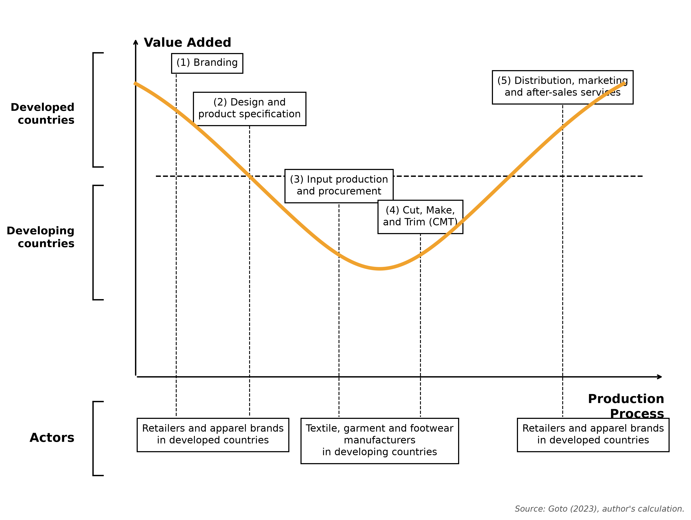{#fig-smile width=90%}

Advances in trade, communication and logistics have enabled different stages of production to be geographically fragmented across countries. Higher value-added activities tend to be concentrated in economies with stronger capabilities in design, branding, technology and specialized services, while labor-intensive manufacturing activities are often undertaken in countries with larger pools of general production workers. Because production processes frequently cross national borders multiple times before the product reaches the final consumer, this phenomenon is commonly referred to as a Global Value Chain (GVC) [@feenstra2021; @gereffi2010; @gupta2022gvc].

Many textile and footwear firms operating in Indonesia are integrated into these GVCs. These firms typically function as contract manufacturers to global brands such as Nike, Adidas, H&M and Uniqlo (often referred to as buyers or principals). The principals ultimately retain control over product design, quality standards, sourcing decisions, logistics and marketing, while the manufacturers primarily provide production services. It is important to note that both raw material and finished goods generally remain under the ownership of the principal throughout the production process. Therefore, any of Indonesia's export statistics will only capture the manufacturing fee, not the embedded, higher value that comes from, for example, design and branding.

Ultimately, Indonesia participates primarily in the manufacturing segment of the value chain, where value added is relatively low, while higher value activities such as branding, design and marketing remain concentrated with the global lead firms. As a result, the export value (measured on a Free on Board basis) primarily captures the manufacturing stage of production undertaken in Indonesia. It does not reflect the substantially higher retail value generated in downstream stages of the value chain.

Given their integration into global value chains, Bonded Zones play an important role in supporting Indonesia's export-oriented textile and footwear industries. Under the Ministry of Finance Regulation No. 131/2018, Bonded Zones are designated areas where imported and/or local supplies to be processed can be stored prior to export or domestic use. Facilities located in Bonded Zones benefit from reduced administrative and tax-related burdens associated with importing machinery and production inputs, thereby supporting the competitiveness of the export-oriented manufacturers. According to @masitoh2024, 453 of the 1455 firms receiving Bonded Zone facilities were textile and garment firms, equivalent to 11.60% of all textile and garment companies in Indonesia.

Alongside these globally integrated firms, Indonesia also has a large number of independent domestic producers that are not directly integrated into GVCs. Unlike export-oriented contract manufacturers, these firms typically operate under their own brands, procure their own inputs and market their products directly to retailers and consumers. They are highly diverse, ranging from medium-sized manufacturers supplying domestic retail chains, to small and micro enterprises, to artisanal producers rooted in regional craft traditions.

This group is generally oriented toward the domestic market and relies primarily on domestic investment. In addition, many of these producers have limited access to proprietary design capabilities or advanced production technology and rely on imported inputs and machinery that may not be covered by the facilitation available to Bonded Zone operators. Their production processes tend to be less complex and are subject to fewer compliance requirements related to the quality standards imposed by global buyers or even the ESPR.

This has given rise to a form of economic dualism within Indonesia's textile and footwear industries. On one side, there are large-scale, often foreign invested firms integrated into GVCs and linked to international buyers. On the other are smaller firms and artisans primarily serving the domestic market. These two groups differ significantly in terms of business models, production structures and competitive challenges. As a result, policy interventions that are effective for globally integrated exporters may not address and/or capture the constraints faced by domestically oriented producers, and vice versa. Recognizing this distinction is therefore essential for effective policy making. Meanwhile, understanding the deeper structural roots requires examining how Indonesia is positioned within the global chains.

## Overview of the Textile & Garments Industry

Indonesia's textile industry spans the full length of the smile curve, and consists of a vertically integrated production chain extending from upstream raw material processing to downstream garment manufacturing and retail activities (@fig-textilechain). Upstream segments, including the processing of petrochemical inputs such as PTA/MEG, polyester fiber production and yarn spinning, tend to be capital and energy intensive. Meanwhile, production becomes more labor-intensive moving downstream, culminating in garment manufacturing and the retail sector. This structural distinction has direct implications for the types of value added generated, the employment profiles supported and the nature of competitive pressures faced at each stage.

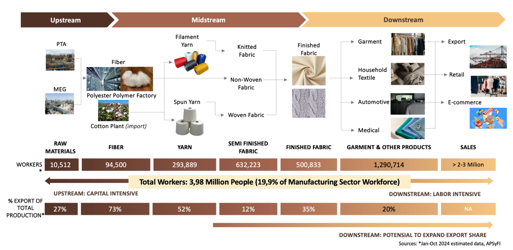{#fig-textilechain width=100%}

Indonesia's upstream textile segments demonstrate a relatively strong export orientation. Fiber and yarn production export shares reach 73% and 52%, respectively (@fig-textilechain). By contrast, downstream activities such as garment manufacturing export 20.00% of their total production. However, employment increases along the value chain, rising from approximately 10,000 workers in raw material processing (PTA/MEG) to more than 1.29 million workers in garment manufacturing.

The complementary roles performed across different segments of the value chain underscore the textile industry's broader strategic importance. Upstream segments contribute to export earnings and integration into GVCs, while downstream segments serve as a major source of formal employment and income. These differences highlight the need for differentiated policy approaches that recognize the distinct constraints, capabilities and opportunities facing firms across segments of the value chain.

The geographic distribution of Indonesia's textile industry indicates that production activity remains heavily concentrated on the island of Java (@fig-maptextile). Of the 761 textile firms recorded, nearly 57% are located in West Java, serving as the primary hub of Indonesia's textile industry, supported by the availability of labor, supporting infrastructure, and proximity to markets and supply chains. Central Java (18%) and Banten (10%) also play important roles as major industrial clusters, while East Java (9.2%) continues to contribute through its concentration of medium-scale industries. Together, these provinces form the core of Indonesia's textile manufacturing base.

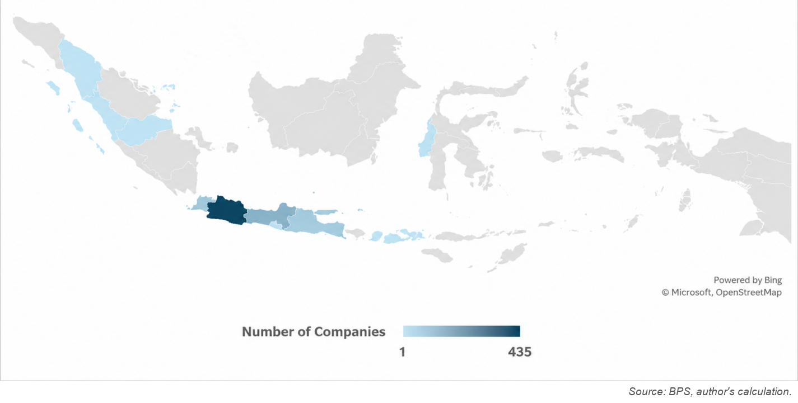{#fig-maptextile width=100%}

Outside of Java (2.37%), textile manufacturers are far fewer in number and more geographically dispersed. Many of these enterprises have emerged from local traditions such as weaving and textile handicrafts. This illustrates the structural heterogeneity at the firm-level where large scale, GVC-integrated manufacturers coexist alongside domestically oriented producers, MSMEs and artisanal enterprises, each facing distinct competitive conditions and policy needs.

## Overview of the Footwear Industry

Indonesia's footwear industry is similarly characterized by a multi-stage production process spanning raw material suppliers, component manufacturers, footwear assembly and distribution to final consumers (@fig-footwearchain; @fig-footwearprocess). Inputs such as leather, rubber, textiles, synthetic materials and chemical components are transformed into footwear parts before being assembled into finished products. While value creation in the industry extends beyond manufacturing to activities such as design, product development, branding, and innovation, production activities remain the dominant segment undertaken in Indonesia.

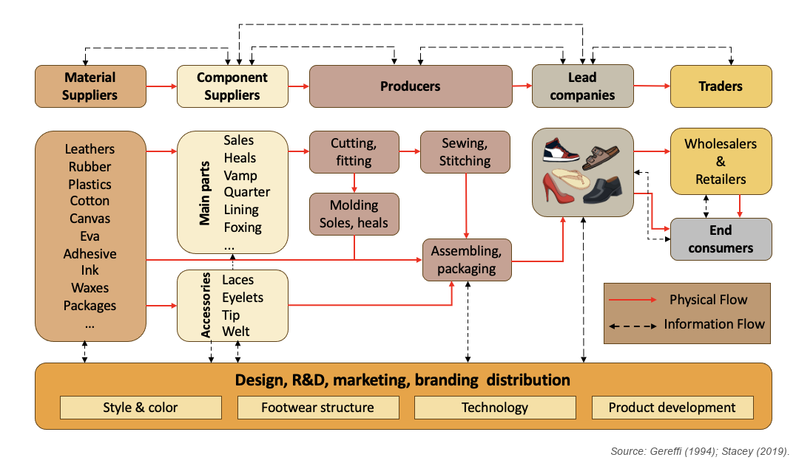{#fig-footwearchain width=100%}

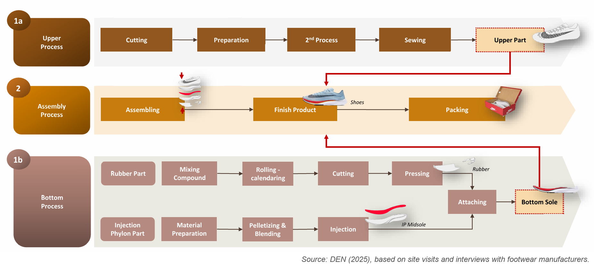{#fig-footwearprocess width=100%}

Many of Indonesia's footwear manufacturers are integrated into the GVC, supplying international brands through export-oriented production networks. As previously mentioned, these firms typically specialize in manufacturing activities within the value chain, while higher-value added functions are often undertaken by global lead firms. The footwear industry's heavy reliance on FDI (accounting for approximately 90% of total investment) reflects this deep integration into international production networks.

At the same time, Indonesia's footwear industry continues to face structural challenges in upstream segments. Dependence on imported inputs remains high, estimated at between 60--70% [@kemenperin2024]. Consistent with the smile curve framework, Indonesia's comparative strength remains concentrated in downstream production activities, while upstream capabilities remain relatively underdeveloped. This represents a structural consideration for long-term competitiveness that warrants continued attention, even as Indonesian footwear products continue to perform well in international markets.

The footwear industry's production base is heavily concentrated on the island of Java (@fig-mapfootwear). West Java hosts the largest number of globally integrated footwear factories, with 42 facilities employing more than 186,000 workers across Sukabumi, Garut, Cibogo and Karawang. Banten and Central Java are home to 29 and 13 factories, respectively, each province employing just over 112,000 workers. The concentration of production in these provinces is supported by industrial infrastructure, access to suppliers and established export networks.

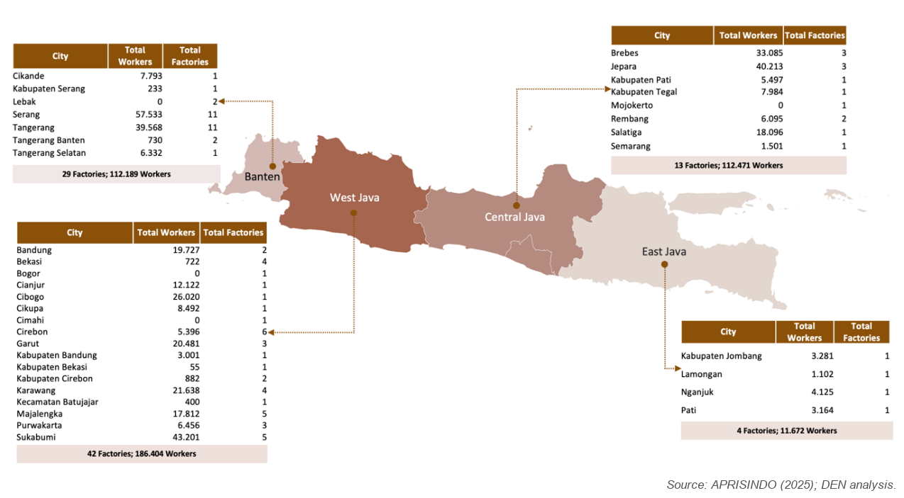{#fig-mapfootwear width=100%}

Recent investment trends suggest that Central Java is emerging as an increasingly important destination for footwear manufacturing expansion. While West Java and Banten remain the industry's largest production centers, relatively lower labor costs and the availability of workers have encouraged firms to establish new facilities and expand existing operations in Central Java. Employment in Central Java's footwear industry is expected to increase by approximately 85,000 workers[^1] over the next one to two years, underscoring the growing importance of the region within Indonesia's footwear manufacturing landscape.

[^1]: Based on DEN interviews and authors' estimates using planned expansions by two major global footwear manufacturers and their supplier networks in Central Java (2025).

This highlights the extent to which developments in Java continue to shape the performance of Indonesia's footwear industry. Given the concentration of manufacturers on the island, efforts to strengthen competitiveness (such as through infrastructure improvements, human capital development and investment incentives) will depend heavily on effective coordination between the central government and provincial government in these key production centers.

# Strategic Issues in the Textile & Garments and Footwear Industry

The strategic challenges facing Indonesia's textile and footwear industry are shaped by the sector's economic dualism and heterogeneous industrial structure. Two implications are particularly important. First, the existence of a relatively complete value chain does not necessarily imply strong integration across all segments. Second, different segments of the industry often face fundamentally different constraints and policy needs.

@fig-trade illustrates the first implication. Although Indonesia has developed a substantial upstream textile industry, the country continues to simultaneously import and export significant volumes of textile raw materials and intermediate goods. The rayon industry provides a useful example. Indonesia is a competitive producer of viscose-based products, yet firms in this segment remain deeply integrated into international markets. Asia Pacific Rayon (APR), for instance, exports 61% of its Viscose Staple Fibre (VSF) production and 71% of its Viscose Yarn output, while Indonesia continues to import rayon and yarn products from abroad [@aprayon2024].

![Exports and imports of textile and footwear-related goods[^2]. Each panel shows Indonesia's trade value in billion USD by year, split by product stage (raw materials, intermediates, finished goods) and flow (import, export).](fig/trade_by_type.png){#fig-trade width=75%}

[^2]: Raw materials are defined as HS Code chapters 50--55; intermediate goods cover chapters 56, 58, 59, and 60; and finished goods encompass chapters 61--64.

One explanation for this pattern is that different segments of the industry often participate in different value chains. Domestic raw material producers may already be integrated into international production networks and supply overseas buyers, while domestic yarn and fabric manufacturers may source inputs from suppliers designated by their clients or brand principals abroad. These relationships are often highly specialized and not easily substitutable. As a result, trade statistics alone cannot fully capture the degree of integration within the industry, and policies based solely on HS-code classifications risk disrupting established value chains.[^3]

[^3]: This is also an issue in other industries that rely on global value chains, such as the food and beverage, machinery, and electronics industries [@gupta2022neraca; @hasran2025].

The second implication of this economic dualism is that different segments of the industry often require different policy responses. Firms integrated into global value chains typically operate under a distinct set of opportunities and constraints compared to domestically oriented producers. Lead firms and global brands play an important coordinating role by providing market access, setting production standards, facilitating knowledge transfer, and reducing commercial risks faced by suppliers [@gereffi2005governance; @fernandezstark2011]. Many export-oriented manufacturers also benefit from stronger access to international markets, financing, and production networks.

In contrast, domestically oriented textile and footwear firms operating under their own brands tend to face greater challenges related to financing, technology upgrading, productivity improvement, and market expansion. Limited access to capital can constrain investment in new machinery and production processes, while smaller scale often makes it more difficult to meet the requirements needed to participate in global value chains. Competition from imports, particularly illegal imports, also remains a significant concern for these firms.

Differences are also evident across the production chain itself. Upstream activities such as fiber production are highly capital and energy-intensive, requiring substantial investment and sufficient downstream demand to remain commercially viable. As a result, the number of firms operating in these segments tends to be relatively limited. Downstream manufacturing, particularly cut-make-trim (CMT) operations, is generally more fragmented and less capital-intensive, allowing firms to expand capacity incrementally as demand grows. Consequently, while upstream competitiveness is often shaped by access to capital, energy, and raw materials, downstream competitiveness depends more heavily on labor availability, workforce skills, and productivity.

These differences highlight the importance of avoiding a one-size-fits-all approach when addressing strategic issues in the textile and footwear industry.

## International Trade

Given the dual economic character and a highly global value chain-linked industrial structure, international trade carries significant implications for this industry. As discussed earlier, the US and the EU remain the industry's most important export markets. Consequently, developments in trade policy and market access in these economies have significant implications for the industry's investment and production in Indonesia.

For the US market, the primary challenges center on policy uncertainty regarding tariffs and cost competitiveness. Indonesian industry is vulnerable to reciprocal tariff threats and the potential loss of Generalized System of Preferences (GSP) benefits, which would directly raise import duties and compress margins. At the same time, Indonesia faces intense competition from countries such as Vietnam, which is highly competitive in terms of domestic production costs. The combined pressure of tariff burdens and cost inefficiencies carries significant potential to challenge exports and investment, underscoring the need for structural transformation to enhance global competitiveness.

For the EU market, the outlook is more favorable. The conclusion in substance of the Indonesia--European Union Comprehensive Economic Partnership Agreement (IEU-CEPA) is expected to provide duty-free access for Indonesian textile and footwear exports. This is particularly important because it would place Indonesian exporters on a more level playing field with competitors such as Vietnam, which already benefits from preferential tariff access to the EU market.

However, access to these preferences depends on compliance with Rules of Origin (RoO), particularly the "double transformation" requirement. Under this rule, products must undergo at least two stages of production within Indonesia to qualify for preferential tariffs. For garments, for example, the fabric itself must also be produced domestically rather than imported. The objective is to prevent transshipment and ensure that tariff preferences are linked to genuine domestic value addition.

For firms operating under CMT (cut-make-trim) arrangements, this requirement presents a significant challenge. Many manufacturers continue to rely on imported fabrics and intermediate inputs supplied through global buyer networks. Compliance with the double transformation rule will therefore require either stronger domestic production of intermediate goods or additional upstream investment by existing suppliers.

While the double transformation requirement creates incentives to strengthen domestic upstream and intermediate industries, imports are likely to remain an important part of the industry's production structure. This is particularly true for specialized inputs, proprietary materials, and products that are not available domestically in the required quality, specification, or volume. As a result, imports play a dual role within the industry. On one hand, they can compete directly with domestic producers in the same segment. On the other, they provide access to inputs that support production, exports, and participation in global value chains. Studies by DEN, Gherzi and Prospera similarly emphasize that imports can both support and challenge industrial development.

The more immediate concern is not legal imports themselves, but illegal imports that circumvent import duties and regulatory requirements altogether. In August 2025, a joint operation by the Ministry of Trade, the State Intelligence Agency (BIN), and the Strategic Intelligence Agency of the Indonesian National Armed Forces (BAIS TNI) seized 19,391 bales of illegal textile imports valued at IDR 112.35 billion [@deviyana2025]. Industry studies suggest that such practices commonly involve underreporting, underinvoicing, and the use of unofficial entry points. Beyond reducing government revenue, illegal imports undermine fair competition and weaken the competitiveness of domestic firms.

## Sustainability Issues

In addition to trade-related issues, sustainability is becoming an increasingly important issue for the textile and footwear industry. This is especially relevant for companies that export to the EU markets, where sustainability requirements are gradually becoming part of market access requirements.

Under the European Green Deal, the European Union has introduced a number of regulations to encourage more sustainable production and consumption patterns. One of the most important for the textile and footwear industry is the Ecodesign for Sustainable Products Regulation (ESPR), which entered into force in 2024 and is currently undergoing further consultation and implementation [@yan2025; @ec2024espr].

The ESPR includes requirements related to product durability, repairability, recyclability, and traceability. One key element is the Digital Product Passport (DPP), which requires information on a product's origin, material composition, production process, and environmental footprint to be traceable throughout the value chain [@costa2025dpp]. Meeting these requirements will require firms to strengthen data collection, traceability systems, and digitalization across their operations.

The implications extend beyond firms directly exporting to the European Union. Because traceability requirements apply throughout the value chain, upstream suppliers are also likely to be affected. This is particularly relevant in the textile industry, where fiber and fabric production is highly capital-intensive and characterized by significant economies of scale. Rather than operating separate production systems for different markets, many producers may find it more practical to adopt these standards across their entire operations.

Several export-oriented manufacturers have already begun adapting to these changes. One fiber and fabric factory in Central Java[^4] has already developed a real-time dashboard system ready to be integrated with systems such as the DPP. The company has also transitioned its entire energy production to biomass.

[^4]: To preserve the confidentiality of commercially sensitive information, the company name is not disclosed. The information is based on an in-depth interview conducted by DEN with an export-oriented fiber and fabric manufacturer in Central Java in 2025.

The transition to greener production, however, remains challenging in Indonesia. While industrial energy costs are relatively competitive, the country's energy system continues to rely heavily on fossil fuels. Manufacturers seeking to reduce their carbon footprint may invest in alternative energy sources such as biomass, solar power, or natural gas, yet each faces its own constraints, including limited biomass availability, regulatory restrictions on solar deployment, and gaps in gas supply and infrastructure.

For many firms, sustainability is no longer solely an environmental issue. Increasingly, it is becoming a business requirement linked to export competitiveness and participation in global value chains.

## Technology

Technology adoption remains an important determinant of competitiveness in Indonesia's textile & garments and footwear industry. Beyond reducing production costs, technological upgrading is increasingly necessary to improve productivity, product quality, and operational efficiency in an increasingly competitive global market.

@fig-machinery illustrates that Indonesia has generally lagged behind regional competitors such as Vietnam in machinery modernization, particularly in spinning and weaving. Over the past decade, Indonesia experienced declining capacity in several upstream segments, including ring spinning, open-end spinning, and shuttleless looms, while Vietnam continued to expand capacity through sustained investment in newer production equipment. This trend suggests that the challenge facing Indonesia is not only one of competitiveness, but also of maintaining productive capacity in strategic upstream segments of the textile value chain.

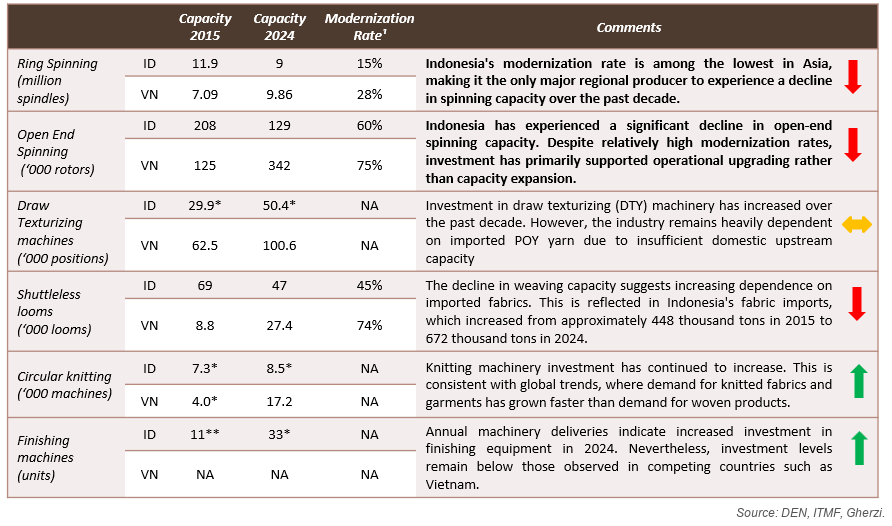{#fig-machinery width=90%}

Older machinery tends to be less productive, more energy-intensive, and more costly to maintain, reducing competitiveness relative to producers that have invested in newer technologies. As a result, machinery modernization remains one of the industry's most pressing priorities, particularly for upstream segments that form the foundation of domestic textile value chains.

Automation is also becoming increasingly important, not necessarily as a substitute for labor, but as a means of improving productivity, quality consistency, and operational efficiency. Several large manufacturers have adopted automated cutting equipment, material handling systems, and warehouse management technologies to reduce production bottlenecks and improve process control. Interviews conducted by DEN with export-oriented manufacturers suggest that automation has helped reduce defect rates, improve product consistency, and enhance production efficiency, all of which are critical for meeting the quality requirements of global buyers[^5]. While broader adoption remains uneven, particularly among smaller firms, automation is likely to become an increasingly important component of industrial upgrading in the years ahead.

[^5]: Based on interviews conducted by DEN with export-oriented textile manufacturers in 2025. Company names are not disclosed to preserve the confidentiality of commercially sensitive information.

## Workforce Readiness

The textile, garment, and footwear industries remain among Indonesia's most important manufacturing employers. Total employment increased from 4.1 million workers in 2020 to more than 5.0 million in 2025, equivalent to approximately one-quarter of formal manufacturing employment nationwide [@bps2025sakernas]. Textile and garment manufacturing continues to dominate employment within the sector, accounting for nearly four million workers in 2025. Nevertheless, the fastest employment growth occurred in the footwear industry, where the workforce expanded by around 60 percent between 2020 and 2025, compared with approximately 15--20 percent growth in textile and garment manufacturing in the same period (@fig-workers).

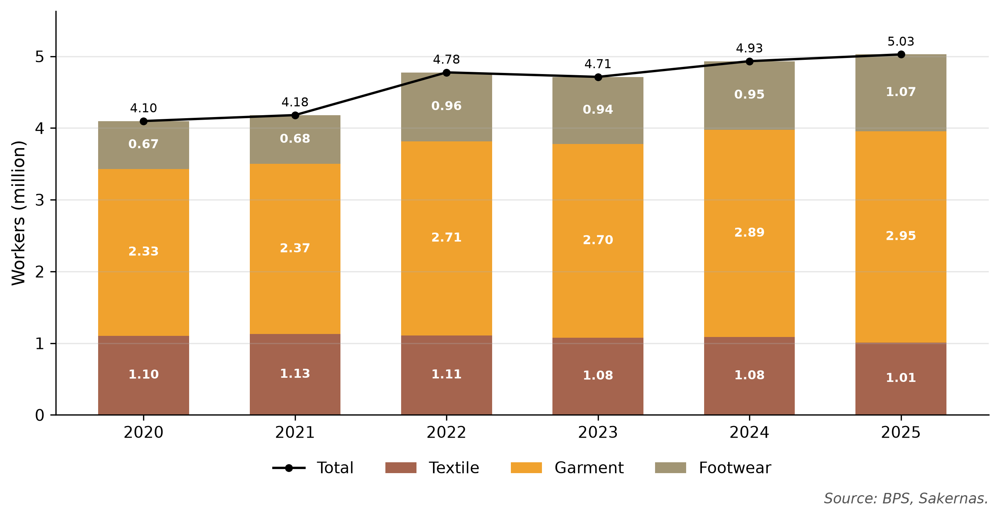{#fig-workers width=70% fig-pos="H"}

The growth in employment naturally raises concerns about whether labor supply can keep pace with industry demand. However, available workforce projections suggest that Indonesia is unlikely to face a shortage of workers for either industry. According to projections from the Ministry of Manpower, the annual supply of vocational graduates (SMK and Vocational graduates) relevant to the textile and footwear industries is expected to continue growing through 2029. For textiles and garments, the supply of graduates is projected to increase from approximately 624,802 in 2025 to 765,763 in 2029, equivalent to average annual growth of 5.2 percent. Footwear-related graduates are projected to rise from around 133,232 to approximately 183 thousand over the same period, representing annual growth of 8.3 percent (@fig-workforce).

![Projected workforce supply for Indonesia's textile & garment, and footwear industries[^6].](fig/workforce_projection.png){#fig-workforce width=95%}

[^6]: Labor Supply Projections for Vocational Education and Training Graduates (SMK and Diploma).

These projected graduate numbers substantially exceed estimated labor demand associated with recent investment activity. Data collected for this study indicate that 27 newly established textile and footwear factories are expected to generate employment in 2025--2026 for approximately 108,000 workers. Against an annual vocational graduate pipeline exceeding 750,000 individuals in 2025, this suggests that labor availability is unlikely to be a binding constraint for either industry in the near term.

Rather, the more important issue appears to be workforce productivity and job readiness. Discussions with industry stakeholders indicate that substantial productivity differences exist across production locations. Footwear manufacturers operating in established industrial clusters in Tangerang, for example, reported significantly higher output per worker than newer facilities in Central Java. Productivity data shared during consultations suggest a range of approximately 1.6 to nearly 5.0 pairs of shoes produced per worker per day. Industry participants attributed much of this variation to differences in workforce experience, factory learning curves, supervisory capabilities, and operational maturity.

As newer facilities gain experience and refine their production processes, part of the productivity gap observed should be narrowed over time. Nevertheless, these findings underscore the importance of workforce readiness and skills development in enabling new production centers to translate labor availability into productivity gains as investment continues to expand.

As previously discussed, Indonesia's position within the textile and garment, and footwear value chains is concentrated in manufacturing and assembly activities. Therefore, competitiveness depends heavily on production efficiency and consistency rather than on capital-intensive upstream capabilities or brand-driven downstream value. Meanwhile, within this segment of the value chain, workforce productivity can be influenced directly through domestic policy, for example through SMK curriculum reforms.

Given that SMK represent the primary pipeline of vocational graduates entering the textile and garment, and footwear industries, the productivity gap observed raises an important policy question: whether current vocational curricula are sufficiently aligned with industry requirements and the production environment that the graduates are expected to enter. This warrants closer examination, including the extent to which textile and garment-related vocational tracks are oriented towards industrial, line-based production processes as opposed to individual or small-batch production models. Notably, as of 2026, footwear does not constitute a standalone vocational program (*jurusan*) within the SMK system. It is instead taught as a module within the broader Leather and Synthetic Leather Craftsmanship curriculum, despite footwear's distinct production processes and its status as a significant export-oriented industry.

Addressing this alignment, such as through closer collaboration between vocational institutions and industry in curriculum development, will likely be necessary to ensure that the strong quantitative growth in labor supply translates into a workforce capable of meeting the productivity standards required to sustain Indonesia's competitiveness in global textile and garment, and footwear value chains.

# Government Policies and Support Programs

The Indonesian government has introduced a range of policies affecting the textile and footwear industry, covering trade, investment, machinery modernization, and workforce development.

On the trade front, Permendag No. 17/2025 introduced import requirements for a range of textile products, including Import Approvals (Persetujuan Impor) and Surveyor Reports (Laporan Surveyor). The regulation aims to strengthen oversight of textile imports while balancing the needs of domestic industry and downstream users. This was followed by Permenperin No. 27/2025, which governs the issuance of technical considerations (pertimbangan teknis/pertek) for textile imports, particularly to ensure the availability of raw materials for domestic manufacturing activities.

Indonesia also continues to utilize trade remedy instruments in the textile sector, including anti-dumping duties (BMAD) and safeguard measures (BMTP) on selected products. Long-standing measures include anti-dumping duties on imports of Polyester Staple Fiber from India, China, and Taiwan, as well as spin drawn yarn from China. More recently, additional anti-dumping and safeguard measures have been applied to products such as woven cotton fabrics and cotton yarn through PMK 48/2024, PMK 67/2025, and PMK 98/2025. These measures are intended to address unfair trade practices and import surges that may adversely affect domestic producers. Their impact, however, varies across segments of the industry. While they may provide additional protection for domestic manufacturers competing directly with imports, they can also increase input costs for firms that rely on imported raw materials and intermediate goods.

The government has also introduced a range of incentives to promote investment across the textile and footwear value chain. These include import duty facilities for machinery and equipment under PMK 179/2009, tax incentives for new investments in labor-intensive industries under PMK 16/2020, and tax holiday facilities under PMK 130/2020 for eligible pioneer industries. Several of these incentives are also relevant to upstream industries, including basic chemical manufacturing, which plays an important role in the production of synthetic fibers and other textile inputs.

On workforce development, the government has introduced incentives to support apprenticeship programs, workforce training, and research activities through the super deduction tax scheme under PMK 128/2019 and PMK 153/2020. Additional support has also been provided to labor-intensive industries, including the textile and footwear sector, through government-borne income tax facilities under PMK 10/2025 and PMK 105/2025.

To support machinery modernization, the government currently operates two complementary programs. The first is the Machinery and Equipment Restructuring Program (Permenperin 20/2024), which provides partial reimbursement for the purchase of new production machinery and equipment. Under the 2026 program, firms may receive reimbursement of up to 25 percent of the purchase value for domestically produced machinery and 10 percent for imported machinery, subject to a maximum reimbursement of IDR 500 million per company. The second is the Labor-Intensive Reinvestment Incentive Program (KIPK), which provides a 5 percent interest subsidy on investment loans ranging from IDR 500 million to IDR 10 billion. Industry stakeholders generally view these programs as positive steps toward supporting industrial modernization but have identified several implementation challenges, including relatively limited reimbursement ceilings, the exclusion of supporting equipment, and eligibility requirements that may constrain participation.

## Regulatory Reform as a Driver of Industrial Competitiveness

Achieving that export ambition will depend not only on financing and incentives, but equally on the speed at which investment commitments can be translated into operational factories and employed workers. Two regulatory areas are particularly relevant in this regard: business licensing (perizinan berusaha) and technical import approvals (pertek impor) for industrial raw materials. Steps have been taken on both fronts, though the degree to which they deliver on their intent will hinge on consistent and measurable implementation across agencies and regions.

Firstly, on the business licensing front, DEN's engagement with textile and garment sector players across West Java, Central Java, Banten, and East Java identified 27 companies totalling 108,179 workers whose investment realization timelines are sensitive to permitting duration (@fig-pipeline).

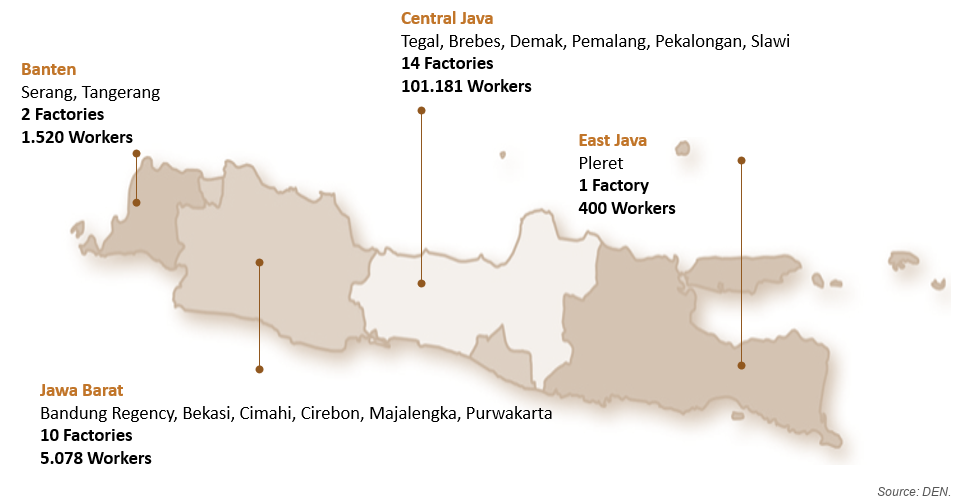{#fig-pipeline width=100%}

A deeper look at one footwear facility in Central Java employing 12,000 workers illustrates the extent to which permitting delays can constrain investment realization. The AMDAL (environmental permit) process alone took approximately 1,095 days, accounting for the majority of the project's licensing timeline (@fig-licensing).

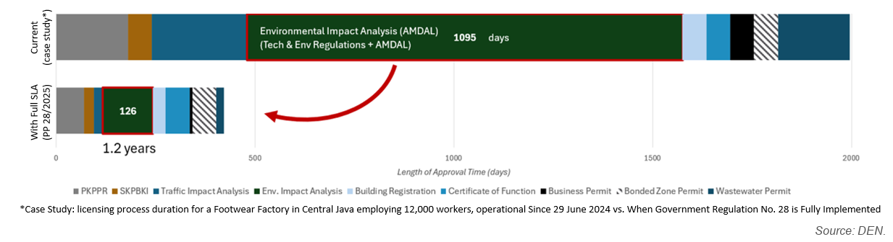{#fig-licensing width=100%}

While this case is illustrative rather than representative, similar challenges have been reported across the sector. Government Regulation No. 28 of 2025 seeks to address these bottlenecks by introducing Service Level Agreements (SLAs) with defined processing timelines for each approval stage. Full implementation could reduce total licensing time from 2--3 years to approximately 1.2 years, including a reduction in AMDAL processing time from 1,095 days to 126 days. The effectiveness of these reforms will ultimately depend on consistent enforcement and strong coordination across all levels of government.

Secondly, beyond business licensing, the efficiency of import approval processes remains an important factor affecting investment realization and industrial competitiveness. In this context, Satgas P3-MPPE, established under Presidential Decree No. 4 of 2026 and coordinated by the Coordinating Ministry for Economic Affairs, has identified the simplification of technical import approvals for industrial raw materials as an early reform priority. The initiative includes adjustments to technical approval requirements under the Ministry of Industry as well as related trade policy revisions under the Ministry of Trade.

For the textile and footwear sectors, these reforms are particularly relevant. Manufacturers rely on timely access to specialized fibers, yarns, chemicals, and other intermediate inputs that are often specified by global buyers and brand principals. Delays in obtaining technical import approvals or clearing imported materials can disrupt production schedules, increase operating costs, and reduce supply chain reliability.

The issue is becoming increasingly important as Indonesia expands its upstream textile capacity through new yarn and fabric investments. These facilities will play a critical role in enabling compliance with the IEU-CEPA double transformation requirement, making efficient import administration an important complement to broader industrial development efforts.

Taken together, reforms in business licensing and import approvals address two regulatory areas that directly influence the pace of investment realization in the textile and footwear sector. If implemented effectively, these measures could accelerate project execution, strengthen investor confidence, and support faster job creation. Indonesia has already introduced many of the necessary policy instruments; the key challenge now lies in ensuring consistent implementation across institutions and levels of government.

# Conclusion

Indonesia's textile and footwear industries remain strategically important not only because of their contribution to exports, but also because of their role as one of the country's largest sources of formal manufacturing employment. The industries are well positioned to benefit from several favorable developments, including the diversification of global sourcing away from China, growing investor interest in Southeast Asia, and the conclusion in substance of the Indonesia--European Union Comprehensive Economic Partnership Agreement (IEU-CEPA). Together, these developments create a window of opportunity for Indonesia to strengthen its position within global textile and footwear value chains.

The findings of this study suggest that Indonesia's competitiveness challenge is not primarily a matter of production costs. Relative to major competitor countries, Indonesia remains broadly competitive in labor, energy, and water costs. Instead, the more significant constraints relate to investment realization, technology upgrading, workforce productivity, and the ability to meet increasingly demanding market requirements, particularly those related to sustainability and traceability.

The study also highlights the importance of recognizing the industry's structural diversity. Indonesia's textile and footwear sectors consist of both globally integrated manufacturers linked to international buyers and domestically oriented producers serving local markets. Differences also exist across the value chain itself, with upstream segments facing challenges related to capital intensity, scale, and raw material availability, while downstream segments depend more heavily on labor productivity, operational efficiency, and market access. As a result, policy interventions need to be tailored to the specific constraints faced by different segments rather than relying on a uniform approach.

In the near term, improving the speed and predictability of investment realization should be a policy priority. Evidence collected in this study indicates that lengthy licensing processes and administrative bottlenecks can significantly delay factory construction and employment creation. Ongoing reforms to business licensing and import approval procedures therefore have the potential to generate substantial economic benefits by accelerating investment implementation, strengthening investor confidence, and supporting job creation.

Over the longer term, Indonesia's ability to capture greater value from the textile and footwear industries will depend on strengthening the domestic industrial ecosystem and improving productivity. While workforce projections suggest that labor supply is unlikely to be a binding constraint, significant productivity gaps remain across production locations, highlighting the importance of workforce readiness, vocational education, and industry-relevant skills development. At the same time, continued investment in machinery modernization, sustainability compliance, and upstream industrial capabilities will be necessary to increase domestic value added and support compliance with evolving global market requirements.

Ultimately, Indonesia's opportunity is not simply to attract more textile and footwear investment, but to deepen its participation in global value chains while increasing the domestic value created from that participation. Achieving this objective will require a coordinated approach that combines regulatory reform, industrial upgrading, workforce development, and ecosystem building. If these challenges can be addressed effectively, the textile and footwear industries can remain an important source of export growth, formal employment, and industrial transformation in the years ahead.

# Reproducibility Statement {.unnumbered}

The source files for this paper are hosted at <https://github.com/den-econ/tekstil>.

# References {.unnumbered}