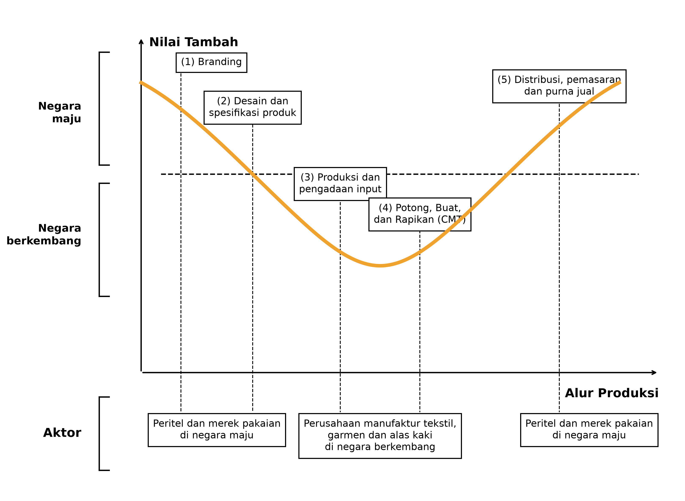

# Pendahuluan

Penciptaan lapangan kerja formal masih menjadi salah satu tantangan utama pembangunan ekonomi Indonesia. Data Badan Pusat Statistik (BPS) menunjukkan bahwa meskipun tingkat pengangguran terbuka menurun dari 4,91 persen pada Agustus 2024 menjadi 4,85 persen pada Agustus 2025, tenaga kerja informal terus tumbuh lebih cepat dibandingkan tenaga kerja formal. Pada saat yang sama, proporsi pekerja penuh waktu menunjukkan tren yang menurun dalam beberapa tahun terakhir [@bps2025tpt; @lubis2025]. Perkembangan tersebut menunjukkan bahwa kinerja pasar tenaga kerja perlu dinilai tidak hanya dari jumlah lapangan kerja yang tercipta, tetapi juga dari kualitas dan formalitas kesempatan kerja tersebut.

Dalam konteks ini, industri tekstil & garmen, serta alas kaki menempati posisi strategis dalam perekonomian Indonesia. Pada 2025, kedua industri tersebut mempekerjakan lebih dari lima juta pekerja, setara dengan sekitar seperempat tenaga kerja manufaktur formal Indonesia. Kontribusi keduanya terhadap penyerapan tenaga kerja jauh lebih besar secara proporsional dibandingkan kontribusinya terhadap output manufaktur, yang mencerminkan sifat padat karya dari proses produksinya. Berdasarkan data BPS, kedua industri juga menghasilkan lapangan kerja per unit investasi yang jauh lebih banyak dibandingkan sebagian besar sektor manufaktur lainnya. Akibatnya, perkembangan industri tekstil dan alas kaki memiliki implikasi langsung terhadap penciptaan lapangan kerja formal, pendapatan rumah tangga, dan inklusi ekonomi yang lebih luas.

Pada saat yang sama, kedua industri menghadapi serangkaian tantangan yang kompleks. Dalam beberapa tahun terakhir, produsen tekstil dan alas kaki terdampak oleh perlambatan permintaan global, persaingan internasional yang semakin ketat, persyaratan keberlanjutan yang semakin ketat di pasar ekspor utama, serta kebutuhan akan peningkatan teknologi dan produktivitas yang berkelanjutan. Tekanan-tekanan tersebut tercermin dari penutupan pabrik dan pemutusan hubungan kerja yang dilaporkan sejak 2023. Namun demikian, di tengah tantangan tersebut, kedua industri tetap menarik investasi baru, terutama dari perusahaan yang terintegrasi ke dalam rantai nilai global dan memasok merek internasional. Kontradiksi yang tampak ini menunjukkan bahwa tantangan yang dihadapi sektor ini tidak dapat dipahami semata-mata sebagai persoalan menurunnya daya saing. Sebaliknya, tantangan tersebut mencerminkan proses transformasi industri yang sedang berlangsung dan membentuk ulang industri tekstil dan alas kaki Indonesia.

Makalah ini menelaah dinamika tersebut secara lebih rinci. Bagian 2 meninjau karakteristik industri tekstil dan alas kaki Indonesia, termasuk struktur rantai nilai, pola investasi, keterkaitan perdagangan, dan heterogenitas industrinya. Bagian 3 membahas isu-isu strategis utama yang memengaruhi daya saing industri, mencakup perdagangan internasional, persyaratan keberlanjutan dan ketertelusuran, modernisasi teknologi, serta kesiapan tenaga kerja. Bagian 4 meninjau kebijakan pemerintah dan program dukungan yang relevan bagi pengembangan sektor ini. Bagian 5 menutup makalah.

# Karakteristik Industri Tekstil & Garmen dan Alas Kaki

## Gambaran Umum

@fig-growth menunjukkan pertumbuhan nilai tambah triwulanan industri tekstil dan garmen serta industri kulit dan alas kaki, dibandingkan dengan manufaktur nonmigas dan pertumbuhan ekonomi secara umum. Industri tekstil dan garmen Indonesia tumbuh sebesar 3,55% pada 2025, dibandingkan 4,26% pada 2024. Industri kulit, barang dari kulit dan alas kaki mencatat pertumbuhan sebesar 3,31 persen pada 2025, setelah ekspansi yang jauh lebih kuat sebesar 6,83 persen pada 2024. Meskipun terjadi moderasi pada 2025, industri alas kaki secara umum berkinerja lebih baik dibandingkan industri tekstil selama periode pemulihan pascapandemi. Secara lebih luas, kedua industri menunjukkan volatilitas yang signifikan selama satu dekade terakhir, yang mencerminkan pergeseran permintaan global dan disrupsi akibat pandemi COVID-19.

{#fig-growth width=85%}

Seperti ditunjukkan @fig-recovery, lebih dari empat tahun setelah pandemi bermula, kedua industri mengalami kondisi yang cukup berbeda. Gambar tersebut menyajikan PDB harga konstan untuk industri tekstil & garmen dan industri alas kaki. Garis oranye solid menunjukkan data PDB aktual, sedangkan garis putus-putus menunjukkan tren prapandemi COVID yang diestimasi menggunakan metode filter HP [@hodrick1997; @razzak1997]. Industri alas kaki tampak mampu kembali ke jalur pertumbuhan jangka panjangnya. Industri tekstil dan garmen, sebaliknya, masih kesulitan mengejar lintasan prapandemi COVID-nya.

{#fig-recovery width=100%}

Investasi langsung pada kedua industri meningkat secara substansial sejak pandemi COVID-19, mencapai level tertingginya selama 2021--2025 (@fig-investment). Namun, kedua industri menunjukkan struktur investasi yang sangat berbeda. Industri tekstil dan garmen memiliki basis investasi yang relatif lebih luas, dengan investor domestik menyumbang antara 19 hingga 61 persen dari total realisasi investasi selama 2010--2025. Sebaliknya, industri alas kaki tetap sangat bergantung pada penanaman modal asing (PMA), dengan investor asing secara konsisten menyumbang sekitar 90 persen atau lebih dari total investasi sepanjang sebagian besar periode tersebut.

{#fig-investment width=100%}

Pertumbuhan investasi terutama menonjol pada industri alas kaki. Antara 2020 dan 2025, total realisasi investasi meningkat dari sekitar USD 241 juta menjadi lebih dari USD 1,6 miliar. Pada periode yang sama, investasi pada industri tekstil dan garmen naik dari sekitar USD 424 juta menjadi USD 1,25 miliar. Akibatnya, pada 2025 industri alas kaki menarik investasi yang lebih tinggi dibandingkan industri tekstil dan garmen meskipun ukurannya jauh lebih kecil dari sisi output. Dominasi investasi asing pada industri alas kaki konsisten dengan partisipasinya yang kuat dalam jaringan produksi berorientasi ekspor, sementara industri tekstil dan garmen terus memperoleh manfaat dari bauran investasi domestik dan asing yang lebih terdiversifikasi.

Pentingnya kedua industri ini juga tercermin dari kinerja ekspornya. Pada 2025, industri tekstil dan garmen Indonesia mencatat nilai ekspor sebesar USD 11,98 miliar dan menghasilkan surplus perdagangan sebesar USD 2,81 miliar. Nilai ekspor menurun tipis sebesar 0,6 persen (yoy), dibandingkan pertumbuhan 3,1 persen pada 2024.

Sebaliknya, industri alas kaki terus mencatat kinerja ekspor yang kuat. Ekspor alas kaki mencapai USD 7,98 miliar pada 2025, meningkat 9,54 persen (yoy), dibandingkan pertumbuhan 13,13 persen pada 2024. Dengan impor sekitar USD 1,32 miliar, industri ini mempertahankan surplus perdagangan yang substansial. Angka-angka tersebut menegaskan pentingnya kedua industri sebagai sumber penerimaan ekspor, sekaligus menyoroti momentum ekspor yang lebih kuat yang saat ini teramati pada industri alas kaki.

Perdagangan internasional memainkan peran yang sangat penting baik pada industri tekstil maupun alas kaki. Dengan menggunakan Tabel Input-Output Multi-Regional (MRIO) Asian Development Bank [@adb2025mrio], dapat diestimasi bahwa sekitar 41,88 persen output industri tekstil pada akhirnya dialokasikan ke pasar ekspor, sementara angka yang sama untuk industri alas kaki mencapai 92,81 persen. Input impor juga tetap menjadi komponen produksi yang kritis. Berdasarkan estimasi yang diturunkan dari kerangka MRIO yang sama, nilai barang dan jasa yang bersumber dari luar negeri mencakup sekitar 72,88 persen dari total input antara yang digunakan industri tekstil dan 84,23 persen pada industri alas kaki. Angka-angka tersebut menunjukkan sejauh mana kedua industri terintegrasi ke dalam jaringan produksi regional dan global, baik sebagai eksportir maupun sebagai pengguna input yang bersumber dari luar negeri.

Amerika Serikat dan Uni Eropa tetap menjadi dua pasar terpenting bagi barang jadi tekstil dan alas kaki dunia. Keduanya secara bersama-sama mencakup sekitar 64,2 persen impor global produk pada Bab HS 61--64 pada 2025, yang terutama terdiri atas pakaian jadi, barang tekstil jadi, dan alas kaki (@fig-globalimport). Uni Eropa merupakan importir terbesar dunia untuk produk-produk tersebut, dengan pangsa 47,1 persen dari total impor global, diikuti Amerika Serikat sebesar 17,1 persen.

{#fig-globalimport width=85%}

Selain perannya sebagai pasar ekspor utama, Uni Eropa juga berperan penting dalam membentuk standar produksi global melalui inisiatif regulasi seperti Ecodesign for Sustainable Products Regulation (ESPR) [@ec2024espr; @yan2025]. Akibatnya, persyaratan keberlanjutan dan ketertelusuran menjadi semakin penting bagi eksportir tekstil dan alas kaki Indonesia yang ingin mengakses pasar Eropa.

@tbl-shares menggambarkan bagaimana persaingan di pasar ekspor tersebut berkembang selama satu dekade terakhir. Antara 2015 dan 2024, pangsa Tiongkok pada impor tekstil dan alas kaki menurun secara substansial baik di Amerika Serikat maupun Uni Eropa. Di Amerika Serikat, pangsa pasar Tiongkok turun dari 44,00% menjadi 29,22%, sedangkan di Uni Eropa turun dari 39,09% menjadi 30,70%. Penerima manfaat terbesar dari pergeseran ini adalah Vietnam dan Bangladesh, yang keduanya mengalami kenaikan pangsa pasar yang cukup besar. Indonesia mencatat kenaikan yang moderat di Amerika Serikat dan sedikit penurunan di Uni Eropa. Tren tersebut menunjukkan bahwa meskipun terdapat peluang bagi Indonesia untuk meraih pangsa permintaan global yang lebih besar, produsen di kawasan pada umumnya lebih berhasil dalam memperluas pangsa pasarnya.

| Mitra | AS 2015 | AS 2024 | AS ∆ (ppt) | UE 2015 | UE 2024 | UE ∆ (ppt) |
|---------|--------:|--------:|-----------:|--------:|--------:|-----------:|
| Tiongkok   | 44,00 | 29,22 | -14,78 | 39,09 | 30,70 | -8,39 |
| Vietnam    | 11,80 | 19,16 |   7,36 |  5,95 |  8,64 |  2,68 |
| India      |  5,14 |  6,52 |   1,38 |  6,89 |  5,37 | -1,53 |
| Bangladesh |  4,37 |  6,03 |   1,66 | 13,12 | 16,07 |  2,95 |
| Indonesia  |  5,04 |  5,46 |   0,42 |  2,66 |  2,15 | -0,52 |
| Meksiko    |  3,84 |  3,71 |  -0,13 |  0,10 |  0,10 |  0,00 |
| Pakistan   |  2,24 |  3,01 |   0,76 |  3,46 |  4,77 |  1,31 |
| Türkiye    |  0,55 |  0,95 |   0,41 |  9,73 |  9,05 | -0,67 |

: Perubahan pangsa pasar ekspor di AS dan UE (persen), 2015--2024. Sumber: UN COMTRADE, perhitungan penulis. {#tbl-shares}

Penting untuk dicatat bahwa secara keseluruhan Indonesia masih relatif kompetitif pada beberapa komponen biaya, terutama biaya energi dan air. @tbl-costs membandingkan indikator biaya produksi utama di antara negara-negara produsen tekstil dan alas kaki utama. Tingkat upah di Indonesia juga masih berada di bawah Tiongkok dan secara umum sebanding dengan India. Indonesia menempati posisi yang relatif kompetitif sebagai basis manufaktur, meskipun keunggulannya tidak merata pada seluruh komponen biaya. Dengan demikian, perolehan pangsa pasar ekspor Indonesia yang relatif moderat tidak dapat dijelaskan hanya oleh biaya produksi. Faktor-faktor lain seperti integrasi rantai pasok, adopsi teknologi, kualitas produk, dan kepatuhan terhadap persyaratan pasar yang terus berkembang kemungkinan juga berperan penting dalam membentuk daya saing.

| Negara | Upah Bulanan (USD) | Tarif Listrik (US¢/kWh) | Biaya Air Baku (US¢/m³) | Biaya Modal (% per tahun) | Biaya Bangunan (USD/m²) |
|------------|-----:|-----:|----:|-------:|----:|
| Indonesia  | 220  | 8    | 15  | 10%    | 263 |
| Vietnam    | 275  | 7,5  | 50  | 6,50%  | 325 |
| Bangladesh | 140  | 10   | 40  | 8%     | 252 |
| Pakistan   | 125  | 15   | 11  | 21%\*  | 303 |
| India      | 220  | 10   | 37  | 11%\*  | 200 |
| Tiongkok   | 600  | 12   | 18  | 4,50%  | 224 |

: Perbandingan biaya produksi antara Indonesia, Vietnam, Bangladesh, Pakistan, India dan Tiongkok (USD dan US¢). Sumber: basis data Gherzi, WTO dan ADB, diakses melalui @ramadhan2025. \* Terdapat insentif suku bunga untuk investasi modal dan modernisasi teknologi. {#tbl-costs}

## Kurva Senyum, Rantai Nilai Global dan Dualisme Ekonomi

Industri tekstil dan alas kaki dicirikan oleh rantai nilai yang menyerupai parabola, yang umum disebut sebagai "kurva senyum" (*smile curve*) karena bentuknya, sebagaimana diilustrasikan @fig-smile [@baldwin2021smile; @goto2023]. Sumbu horizontal menunjukkan proses produksi dari kegiatan hulu ke hilir, sedangkan sumbu vertikal menunjukkan nilai tambah yang dihasilkan pada setiap tahap produksi. Pada kedua industri, nilai tambah cenderung terkonsentrasi pada ujung hulu dan hilir rantai nilai (seperti kegiatan *branding*, desain, pemasaran dan layanan pascaproduksi), sementara kegiatan manufaktur (terutama operasi *cut-make-trim* (CMT)) pada umumnya menghasilkan nilai tambah yang lebih rendah.

{#fig-smile width=90%}

Kemajuan pada perdagangan, komunikasi dan logistik telah memungkinkan tahapan produksi yang berbeda terfragmentasi secara geografis lintas negara. Kegiatan bernilai tambah lebih tinggi cenderung terkonsentrasi di negara dengan kapabilitas yang lebih kuat pada desain, *branding*, teknologi dan jasa terspesialisasi, sementara kegiatan manufaktur padat karya kerap dilakukan di negara dengan pasokan tenaga kerja produksi umum yang lebih besar. Karena proses produksi sering melintasi batas negara berkali-kali sebelum produk sampai ke konsumen akhir, fenomena ini umum disebut sebagai Rantai Nilai Global (*Global Value Chain*/GVC) [@feenstra2021; @gereffi2010; @gupta2022gvc].

Banyak perusahaan tekstil dan alas kaki yang beroperasi di Indonesia terintegrasi ke dalam GVC tersebut. Perusahaan-perusahaan ini umumnya berfungsi sebagai manufaktur kontrak bagi merek global seperti Nike, Adidas, H&M dan Uniqlo (yang sering disebut sebagai *buyer* atau prinsipal). Prinsipal pada akhirnya memegang kendali atas desain produk, standar kualitas, keputusan pengadaan, logistik dan pemasaran, sementara pihak manufaktur terutama menyediakan jasa produksi. Penting dicatat bahwa baik bahan baku maupun barang jadi pada umumnya tetap menjadi milik prinsipal sepanjang proses produksi. Karena itu, statistik ekspor Indonesia hanya akan menangkap ongkos manufaktur, bukan nilai yang lebih tinggi yang melekat dan berasal, misalnya, dari desain dan *branding*.

Pada akhirnya, Indonesia terutama berpartisipasi pada segmen manufaktur dari rantai nilai, di mana nilai tambahnya relatif rendah, sementara kegiatan bernilai lebih tinggi seperti *branding*, desain dan pemasaran tetap terkonsentrasi pada perusahaan utama (*lead firm*) global. Akibatnya, nilai ekspor (diukur atas dasar *Free on Board*) terutama menangkap tahap manufaktur yang dilakukan di Indonesia. Nilai tersebut tidak mencerminkan nilai ritel yang jauh lebih tinggi yang dihasilkan pada tahapan hilir dari rantai nilai.

Mengingat integrasinya ke dalam rantai nilai global, Kawasan Berikat berperan penting dalam mendukung industri tekstil dan alas kaki Indonesia yang berorientasi ekspor. Berdasarkan Peraturan Menteri Keuangan No. 131/2018, Kawasan Berikat merupakan kawasan yang ditetapkan untuk menimbun barang impor dan/atau barang dari dalam negeri yang akan diolah, sebelum diekspor atau digunakan di dalam negeri. Fasilitas yang berlokasi di Kawasan Berikat memperoleh manfaat berupa berkurangnya beban administratif dan perpajakan terkait impor mesin dan input produksi, sehingga mendukung daya saing manufaktur berorientasi ekspor. Menurut @masitoh2024, 453 dari 1455 perusahaan penerima fasilitas Kawasan Berikat merupakan perusahaan tekstil dan garmen, setara dengan 11,60% dari seluruh perusahaan tekstil dan garmen di Indonesia.

Berdampingan dengan perusahaan yang terintegrasi secara global tersebut, Indonesia juga memiliki sejumlah besar produsen domestik independen yang tidak terintegrasi langsung ke dalam GVC. Berbeda dengan manufaktur kontrak berorientasi ekspor, perusahaan-perusahaan ini umumnya beroperasi dengan merek sendiri, mengadakan inputnya sendiri dan memasarkan produknya secara langsung kepada peritel dan konsumen. Kelompok ini sangat beragam, mulai dari manufaktur skala menengah yang memasok jaringan ritel domestik, usaha kecil dan mikro, hingga produsen artisanal yang berakar pada tradisi kriya daerah.

Kelompok ini pada umumnya berorientasi pada pasar domestik dan terutama bertumpu pada investasi domestik. Selain itu, banyak di antara produsen tersebut memiliki akses terbatas terhadap kapabilitas desain milik sendiri atau teknologi produksi mutakhir, serta bergantung pada input dan mesin impor yang mungkin tidak tercakup oleh fasilitasi yang tersedia bagi pelaku Kawasan Berikat. Proses produksi mereka cenderung kurang kompleks dan tunduk pada persyaratan kepatuhan yang lebih sedikit terkait standar kualitas yang ditetapkan pembeli global ataupun ESPR.

Hal ini memunculkan suatu bentuk dualisme ekonomi di dalam industri tekstil dan alas kaki Indonesia. Di satu sisi, terdapat perusahaan berskala besar, yang kerap merupakan penanaman modal asing, yang terintegrasi ke dalam GVC dan terhubung dengan pembeli internasional. Di sisi lain terdapat perusahaan yang lebih kecil dan artisan yang terutama melayani pasar domestik. Kedua kelompok ini berbeda secara signifikan dari sisi model bisnis, struktur produksi dan tantangan persaingan. Akibatnya, intervensi kebijakan yang efektif bagi eksportir yang terintegrasi secara global boleh jadi tidak menjawab dan/atau menangkap kendala yang dihadapi produsen berorientasi domestik, dan sebaliknya. Mengenali perbedaan ini karena itu menjadi esensial bagi perumusan kebijakan yang efektif. Sementara itu, memahami akar struktural yang lebih dalam menuntut penelaahan atas bagaimana Indonesia diposisikan di dalam rantai global.

## Gambaran Umum Industri Tekstil & Garmen

Industri tekstil Indonesia membentang di sepanjang kurva senyum, dan terdiri atas rantai produksi yang terintegrasi secara vertikal mulai dari pengolahan bahan baku di hulu hingga manufaktur garmen dan kegiatan ritel di hilir (@fig-textilechain). Segmen hulu, termasuk pengolahan input petrokimia seperti PTA/MEG, produksi serat poliester dan pemintalan benang, cenderung padat modal dan padat energi. Sementara itu, produksi menjadi semakin padat karya ke arah hilir, yang berpuncak pada manufaktur garmen dan sektor ritel. Perbedaan struktural ini berimplikasi langsung pada jenis nilai tambah yang dihasilkan, profil ketenagakerjaan yang ditopang, dan sifat tekanan persaingan yang dihadapi pada setiap tahap.

{#fig-textilechain width=100%}

Segmen hulu tekstil Indonesia menunjukkan orientasi ekspor yang relatif kuat. Pangsa ekspor produksi serat dan benang masing-masing mencapai 73% dan 52% (@fig-textilechain). Sebaliknya, kegiatan hilir seperti manufaktur garmen mengekspor 20,00% dari total produksinya. Namun, penyerapan tenaga kerja meningkat di sepanjang rantai nilai, naik dari sekitar 10.000 pekerja pada pengolahan bahan baku (PTA/MEG) menjadi lebih dari 1,29 juta pekerja pada manufaktur garmen.

Peran yang saling melengkapi di antara berbagai segmen rantai nilai menegaskan arti penting strategis industri tekstil secara lebih luas. Segmen hulu berkontribusi pada penerimaan ekspor dan integrasi ke dalam GVC, sementara segmen hilir menjadi sumber utama lapangan kerja formal dan pendapatan. Perbedaan-perbedaan ini menegaskan perlunya pendekatan kebijakan yang terdiferensiasi, yang mengenali perbedaan kendala, kapabilitas dan peluang yang dihadapi perusahaan di berbagai segmen rantai nilai.

Distribusi geografis industri tekstil Indonesia menunjukkan bahwa kegiatan produksi masih sangat terkonsentrasi di Pulau Jawa (@fig-maptextile). Dari 761 perusahaan tekstil yang tercatat, hampir 57% berlokasi di Jawa Barat, yang berfungsi sebagai pusat utama industri tekstil Indonesia, ditopang oleh ketersediaan tenaga kerja, infrastruktur pendukung, serta kedekatan dengan pasar dan rantai pasok. Jawa Tengah (18%) dan Banten (10%) juga berperan penting sebagai klaster industri utama, sementara Jawa Timur (9,2%) terus berkontribusi melalui konsentrasi industri skala menengahnya. Secara bersama-sama, provinsi-provinsi tersebut membentuk inti basis manufaktur tekstil Indonesia.

{#fig-maptextile width=100%}

Di luar Jawa (2,37%), jumlah manufaktur tekstil jauh lebih sedikit dan tersebar secara geografis. Banyak di antara usaha tersebut tumbuh dari tradisi lokal seperti tenun dan kerajinan tekstil. Hal ini menggambarkan heterogenitas struktural pada tingkat perusahaan, di mana manufaktur berskala besar yang terintegrasi ke dalam GVC hidup berdampingan dengan produsen berorientasi domestik, UMKM dan usaha artisanal, yang masing-masing menghadapi kondisi persaingan dan kebutuhan kebijakan yang berbeda.

## Gambaran Umum Industri Alas Kaki

Industri alas kaki Indonesia serupa dicirikan oleh proses produksi bertahap yang mencakup pemasok bahan baku, manufaktur komponen, perakitan alas kaki dan distribusi kepada konsumen akhir (@fig-footwearchain; @fig-footwearprocess). Input seperti kulit, karet, tekstil, bahan sintetis dan komponen kimia diolah menjadi bagian-bagian alas kaki sebelum dirakit menjadi produk jadi. Meskipun penciptaan nilai pada industri ini melampaui kegiatan manufaktur hingga ke kegiatan seperti desain, pengembangan produk, *branding*, dan inovasi, kegiatan produksi tetap menjadi segmen dominan yang dilakukan di Indonesia.

{#fig-footwearchain width=100%}

{#fig-footwearprocess width=100%}

Banyak manufaktur alas kaki Indonesia yang terintegrasi ke dalam GVC, memasok merek internasional melalui jaringan produksi berorientasi ekspor. Sebagaimana disebutkan sebelumnya, perusahaan-perusahaan ini umumnya berspesialisasi pada kegiatan manufaktur di dalam rantai nilai, sementara fungsi bernilai tambah lebih tinggi kerap dilakukan oleh perusahaan utama global. Ketergantungan industri alas kaki yang besar pada PMA (mencakup sekitar 90% total investasi) mencerminkan integrasi yang dalam ke dalam jaringan produksi internasional tersebut.

Pada saat yang sama, industri alas kaki Indonesia terus menghadapi tantangan struktural pada segmen hulu. Ketergantungan pada input impor masih tinggi, diperkirakan berkisar antara 60--70% [@kemenperin2024]. Konsisten dengan kerangka kurva senyum, kekuatan komparatif Indonesia tetap terkonsentrasi pada kegiatan produksi hilir, sementara kapabilitas hulu masih relatif kurang berkembang. Hal ini merupakan pertimbangan struktural bagi daya saing jangka panjang yang perlu terus mendapat perhatian, sekalipun produk alas kaki Indonesia terus berkinerja baik di pasar internasional.

Basis produksi industri alas kaki sangat terkonsentrasi di Pulau Jawa (@fig-mapfootwear). Jawa Barat menjadi lokasi bagi jumlah pabrik alas kaki terintegrasi global terbanyak, dengan 42 fasilitas yang mempekerjakan lebih dari 186.000 pekerja di Sukabumi, Garut, Cibogo dan Karawang. Banten dan Jawa Tengah masing-masing menjadi lokasi bagi 29 dan 13 pabrik, dengan setiap provinsi mempekerjakan sedikit di atas 112.000 pekerja. Konsentrasi produksi di provinsi-provinsi tersebut ditopang oleh infrastruktur industri, akses terhadap pemasok dan jaringan ekspor yang telah mapan.

{#fig-mapfootwear width=100%}

Tren investasi terkini menunjukkan bahwa Jawa Tengah muncul sebagai tujuan yang semakin penting bagi ekspansi manufaktur alas kaki. Meskipun Jawa Barat dan Banten tetap menjadi pusat produksi terbesar industri ini, biaya tenaga kerja yang relatif lebih rendah dan ketersediaan pekerja telah mendorong perusahaan mendirikan fasilitas baru dan memperluas operasi yang ada di Jawa Tengah. Penyerapan tenaga kerja pada industri alas kaki di Jawa Tengah diperkirakan meningkat sekitar 85.000 pekerja[^1] dalam satu hingga dua tahun ke depan, yang menegaskan semakin pentingnya wilayah tersebut dalam lanskap manufaktur alas kaki Indonesia.

[^1]: Berdasarkan wawancara DEN dan estimasi penulis dengan menggunakan rencana ekspansi dua manufaktur alas kaki global besar dan jaringan pemasoknya di Jawa Tengah (2025).

Hal ini menegaskan sejauh mana perkembangan di Jawa terus membentuk kinerja industri alas kaki Indonesia. Mengingat konsentrasi manufaktur di pulau tersebut, upaya memperkuat daya saing (misalnya melalui perbaikan infrastruktur, pengembangan sumber daya manusia dan insentif investasi) akan sangat bergantung pada koordinasi yang efektif antara pemerintah pusat dan pemerintah provinsi di pusat-pusat produksi utama tersebut.

# Isu Strategis pada Industri Tekstil & Garmen dan Alas Kaki

Tantangan strategis yang dihadapi industri tekstil dan alas kaki Indonesia dibentuk oleh dualisme ekonomi dan struktur industri yang heterogen pada sektor ini. Dua implikasinya sangat penting. Pertama, keberadaan rantai nilai yang relatif lengkap tidak serta-merta berarti adanya integrasi yang kuat di seluruh segmen. Kedua, segmen industri yang berbeda kerap menghadapi kendala dan kebutuhan kebijakan yang secara mendasar berbeda.

@fig-trade mengilustrasikan implikasi pertama. Meskipun Indonesia telah mengembangkan industri tekstil hulu yang substansial, negara ini terus secara bersamaan mengimpor dan mengekspor bahan baku dan barang antara tekstil dalam volume yang signifikan. Industri rayon memberikan contoh yang berguna. Indonesia merupakan produsen produk berbasis viscose yang kompetitif, namun perusahaan pada segmen ini tetap terintegrasi secara dalam ke pasar internasional. Asia Pacific Rayon (APR), misalnya, mengekspor 61% produksi *Viscose Staple Fibre* (VSF) dan 71% output *Viscose Yarn*-nya, sementara Indonesia terus mengimpor produk rayon dan benang dari luar negeri [@aprayon2024].

![Ekspor dan impor barang terkait tekstil dan alas kaki[^2]. Setiap panel menunjukkan nilai perdagangan Indonesia dalam miliar USD menurut tahun, dipilah menurut tahapan produk (bahan baku, barang antara, barang jadi) dan arus (impor, ekspor). Sumber: UN COMTRADE.](fig/trade_by_type.png){#fig-trade width=75%}

[^2]: Bahan baku didefinisikan sebagai Bab Kode HS 50--55; barang antara mencakup bab 56, 58, 59, dan 60; dan barang jadi meliputi bab 61--64.

Salah satu penjelasan atas pola tersebut adalah bahwa segmen industri yang berbeda kerap berpartisipasi pada rantai nilai yang berbeda. Produsen bahan baku domestik boleh jadi telah terintegrasi ke dalam jaringan produksi internasional dan memasok pembeli di luar negeri, sementara manufaktur benang dan kain domestik boleh jadi memperoleh input dari pemasok yang ditunjuk oleh klien atau prinsipal mereknya di luar negeri. Hubungan-hubungan tersebut kerap sangat terspesialisasi dan tidak mudah disubstitusi. Akibatnya, statistik perdagangan saja tidak dapat sepenuhnya menangkap derajat integrasi di dalam industri, dan kebijakan yang semata-mata didasarkan pada klasifikasi kode HS berisiko mengganggu rantai nilai yang telah terbangun.[^3]

[^3]: Hal ini juga menjadi persoalan pada industri lain yang bertumpu pada rantai nilai global, seperti industri makanan dan minuman, permesinan, dan elektronik [@gupta2022neraca; @hasran2025].

Implikasi kedua dari dualisme ekonomi ini adalah bahwa segmen industri yang berbeda kerap memerlukan respons kebijakan yang berbeda. Perusahaan yang terintegrasi ke dalam rantai nilai global umumnya beroperasi dengan serangkaian peluang dan kendala yang berbeda dibandingkan produsen berorientasi domestik. Perusahaan utama dan merek global memainkan peran koordinasi yang penting dengan menyediakan akses pasar, menetapkan standar produksi, memfasilitasi alih pengetahuan, dan mengurangi risiko komersial yang dihadapi pemasok [@gereffi2005governance; @fernandezstark2011]. Banyak manufaktur berorientasi ekspor juga memperoleh manfaat dari akses yang lebih kuat terhadap pasar internasional, pembiayaan, dan jaringan produksi.

Sebaliknya, perusahaan tekstil dan alas kaki berorientasi domestik yang beroperasi dengan merek sendiri cenderung menghadapi tantangan yang lebih besar terkait pembiayaan, peningkatan teknologi, perbaikan produktivitas, dan perluasan pasar. Akses yang terbatas terhadap modal dapat membatasi investasi pada mesin dan proses produksi baru, sementara skala yang lebih kecil kerap mempersulit pemenuhan persyaratan yang dibutuhkan untuk berpartisipasi dalam rantai nilai global. Persaingan dari impor, terutama impor ilegal, juga tetap menjadi kekhawatiran yang signifikan bagi perusahaan-perusahaan tersebut.

Perbedaan juga tampak di sepanjang rantai produksi itu sendiri. Kegiatan hulu seperti produksi serat sangat padat modal dan padat energi, sehingga membutuhkan investasi yang besar dan permintaan hilir yang memadai agar tetap layak secara komersial. Akibatnya, jumlah perusahaan yang beroperasi pada segmen tersebut cenderung relatif terbatas. Manufaktur hilir, terutama operasi *cut-make-trim* (CMT), pada umumnya lebih terfragmentasi dan kurang padat modal, sehingga memungkinkan perusahaan menambah kapasitas secara bertahap seiring pertumbuhan permintaan. Oleh karena itu, sementara daya saing hulu kerap dibentuk oleh akses terhadap modal, energi, dan bahan baku, daya saing hilir lebih banyak bergantung pada ketersediaan tenaga kerja, keterampilan pekerja, dan produktivitas.

Perbedaan-perbedaan tersebut menegaskan pentingnya menghindari pendekatan seragam (*one-size-fits-all*) dalam menangani isu strategis pada industri tekstil dan alas kaki.

## Perdagangan Internasional

Mengingat karakter ekonomi yang dualistik dan struktur industri yang sangat terkait dengan rantai nilai global, perdagangan internasional membawa implikasi yang signifikan bagi industri ini. Sebagaimana dibahas sebelumnya, AS dan UE tetap menjadi pasar ekspor terpenting industri ini. Akibatnya, perkembangan kebijakan perdagangan dan akses pasar pada kedua perekonomian tersebut memiliki implikasi yang signifikan bagi investasi dan produksi industri ini di Indonesia.

Untuk pasar AS, tantangan utama berpusat pada ketidakpastian kebijakan terkait tarif dan daya saing biaya. Industri Indonesia rentan terhadap ancaman tarif resiprokal dan potensi hilangnya manfaat *Generalized System of Preferences* (GSP), yang akan secara langsung menaikkan bea masuk dan menekan margin. Pada saat yang sama, Indonesia menghadapi persaingan ketat dari negara seperti Vietnam, yang sangat kompetitif dari sisi biaya produksi domestik. Tekanan gabungan dari beban tarif dan inefisiensi biaya berpotensi signifikan menantang ekspor dan investasi, yang menegaskan perlunya transformasi struktural untuk meningkatkan daya saing global.

Untuk pasar UE, prospeknya lebih menguntungkan. Penyelesaian secara substansi *Indonesia--European Union Comprehensive Economic Partnership Agreement* (IEU-CEPA) diharapkan memberikan akses bebas bea bagi ekspor tekstil dan alas kaki Indonesia. Hal ini sangat penting karena akan menempatkan eksportir Indonesia pada posisi yang lebih setara dengan pesaing seperti Vietnam, yang telah memperoleh manfaat dari akses tarif preferensial ke pasar UE.

Namun, akses terhadap preferensi tersebut bergantung pada kepatuhan terhadap Ketentuan Asal Barang (*Rules of Origin*/RoO), khususnya persyaratan "transformasi ganda" (*double transformation*). Berdasarkan ketentuan ini, produk harus melalui sekurang-kurangnya dua tahap produksi di dalam negeri untuk memenuhi syarat tarif preferensial. Untuk garmen, misalnya, kainnya pun harus diproduksi di dalam negeri, bukan diimpor. Tujuannya adalah mencegah *transshipment* dan memastikan bahwa preferensi tarif terkait dengan penciptaan nilai tambah domestik yang sesungguhnya.

Bagi perusahaan yang beroperasi dengan skema CMT (*cut-make-trim*), persyaratan ini merupakan tantangan yang signifikan. Banyak manufaktur masih bertumpu pada kain dan input antara impor yang dipasok melalui jaringan pembeli global. Kepatuhan terhadap ketentuan transformasi ganda karena itu akan menuntut penguatan produksi barang antara di dalam negeri atau tambahan investasi hulu oleh pemasok yang ada.

Meskipun persyaratan transformasi ganda menciptakan insentif untuk memperkuat industri hulu dan antara domestik, impor kemungkinan akan tetap menjadi bagian penting dari struktur produksi industri ini. Hal ini terutama berlaku untuk input terspesialisasi, bahan bermilik (*proprietary*), dan produk yang tidak tersedia di dalam negeri dengan kualitas, spesifikasi, atau volume yang dibutuhkan. Akibatnya, impor memainkan peran ganda di dalam industri ini. Di satu sisi, impor dapat bersaing secara langsung dengan produsen domestik pada segmen yang sama. Di sisi lain, impor menyediakan akses terhadap input yang menopang produksi, ekspor, dan partisipasi dalam rantai nilai global. Kajian oleh DEN, Gherzi dan Prospera serupa menekankan bahwa impor dapat sekaligus mendukung dan menantang pembangunan industri.

Kekhawatiran yang lebih mendesak bukanlah impor legal itu sendiri, melainkan impor ilegal yang sama sekali menghindari bea masuk dan persyaratan regulasi. Pada Agustus 2025, operasi gabungan Kementerian Perdagangan, Badan Intelijen Negara (BIN), dan Badan Intelijen Strategis TNI (BAIS TNI) menyita 19.391 bal impor tekstil ilegal senilai Rp112,35 miliar [@deviyana2025]. Kajian industri menunjukkan bahwa praktik semacam itu umumnya melibatkan pelaporan yang tidak sesuai (*underreporting*), *underinvoicing*, dan penggunaan pintu masuk tidak resmi. Selain mengurangi penerimaan negara, impor ilegal merusak persaingan yang adil dan melemahkan daya saing perusahaan domestik.

## Isu Keberlanjutan

Selain isu terkait perdagangan, keberlanjutan menjadi isu yang semakin penting bagi industri tekstil dan alas kaki. Hal ini terutama relevan bagi perusahaan yang mengekspor ke pasar UE, di mana persyaratan keberlanjutan secara bertahap menjadi bagian dari persyaratan akses pasar.

Dalam kerangka *European Green Deal*, Uni Eropa telah memperkenalkan sejumlah regulasi untuk mendorong pola produksi dan konsumsi yang lebih berkelanjutan. Salah satu yang terpenting bagi industri tekstil dan alas kaki adalah *Ecodesign for Sustainable Products Regulation* (ESPR), yang mulai berlaku pada 2024 dan saat ini masih menjalani konsultasi dan implementasi lebih lanjut [@yan2025; @ec2024espr].

ESPR mencakup persyaratan terkait durabilitas, keterbaikan (*repairability*), daur ulang, dan ketertelusuran produk. Salah satu elemen kuncinya adalah *Digital Product Passport* (DPP), yang mensyaratkan informasi mengenai asal produk, komposisi bahan, proses produksi, dan jejak lingkungannya dapat ditelusuri di sepanjang rantai nilai [@costa2025dpp]. Pemenuhan persyaratan tersebut menuntut perusahaan memperkuat pengumpulan data, sistem ketertelusuran, dan digitalisasi di seluruh operasinya.

Implikasinya melampaui perusahaan yang mengekspor langsung ke Uni Eropa. Karena persyaratan ketertelusuran berlaku di sepanjang rantai nilai, pemasok hulu juga kemungkinan terdampak. Hal ini terutama relevan pada industri tekstil, di mana produksi serat dan kain sangat padat modal dan dicirikan oleh skala ekonomi yang signifikan. Alih-alih mengoperasikan sistem produksi terpisah untuk pasar yang berbeda, banyak produsen mungkin menilai lebih praktis untuk menerapkan standar tersebut pada seluruh operasinya.

Beberapa manufaktur berorientasi ekspor telah mulai menyesuaikan diri dengan perubahan tersebut. Sebuah pabrik serat dan kain di Jawa Tengah[^4] telah mengembangkan sistem dasbor waktu nyata (*real-time*) yang siap diintegrasikan dengan sistem seperti DPP. Perusahaan tersebut juga telah mengalihkan seluruh produksi energinya ke biomassa.

[^4]: Untuk menjaga kerahasiaan informasi yang sensitif secara komersial, nama perusahaan tidak diungkapkan. Informasi ini didasarkan pada wawancara mendalam yang dilakukan DEN dengan sebuah manufaktur serat dan kain berorientasi ekspor di Jawa Tengah pada 2025.

Namun, transisi menuju produksi yang lebih hijau masih menjadi tantangan di Indonesia. Meskipun biaya energi industri relatif kompetitif, sistem energi negara ini masih sangat bergantung pada bahan bakar fosil. Manufaktur yang berupaya mengurangi jejak karbonnya dapat berinvestasi pada sumber energi alternatif seperti biomassa, tenaga surya, atau gas alam, namun masing-masing menghadapi kendalanya sendiri, termasuk keterbatasan ketersediaan biomassa, pembatasan regulasi atas pemanfaatan tenaga surya, serta kesenjangan pasokan dan infrastruktur gas.

Bagi banyak perusahaan, keberlanjutan tidak lagi semata-mata merupakan isu lingkungan. Isu ini semakin menjadi persyaratan bisnis yang terkait dengan daya saing ekspor dan partisipasi dalam rantai nilai global.

## Teknologi

Adopsi teknologi tetap menjadi penentu penting daya saing industri tekstil & garmen dan alas kaki Indonesia. Selain menurunkan biaya produksi, peningkatan teknologi semakin diperlukan untuk memperbaiki produktivitas, kualitas produk, dan efisiensi operasional di pasar global yang semakin kompetitif.

@fig-machinery mengilustrasikan bahwa Indonesia secara umum tertinggal dari pesaing di kawasan seperti Vietnam dalam hal modernisasi permesinan, terutama pada pemintalan dan pertenunan. Selama satu dekade terakhir, Indonesia mengalami penurunan kapasitas pada beberapa segmen hulu, termasuk *ring spinning*, *open-end spinning*, dan *shuttleless loom*, sementara Vietnam terus memperluas kapasitas melalui investasi berkelanjutan pada peralatan produksi yang lebih baru. Tren ini menunjukkan bahwa tantangan yang dihadapi Indonesia bukan hanya soal daya saing, tetapi juga mempertahankan kapasitas produktif pada segmen hulu yang strategis dari rantai nilai tekstil.

{#fig-machinery width=90%}

Mesin yang lebih tua cenderung kurang produktif, lebih boros energi, dan lebih mahal untuk dipelihara, sehingga menurunkan daya saing relatif terhadap produsen yang telah berinvestasi pada teknologi yang lebih baru. Akibatnya, modernisasi permesinan tetap menjadi salah satu prioritas paling mendesak bagi industri ini, terutama bagi segmen hulu yang menjadi fondasi rantai nilai tekstil domestik.

Otomasi juga menjadi semakin penting, tidak harus sebagai pengganti tenaga kerja, melainkan sebagai sarana untuk meningkatkan produktivitas, konsistensi kualitas, dan efisiensi operasional. Beberapa manufaktur besar telah mengadopsi peralatan pemotongan otomatis, sistem penanganan material, dan teknologi manajemen gudang untuk mengurangi hambatan produksi dan memperbaiki pengendalian proses. Wawancara yang dilakukan DEN dengan manufaktur berorientasi ekspor menunjukkan bahwa otomasi membantu menurunkan tingkat kecacatan, memperbaiki konsistensi produk, dan meningkatkan efisiensi produksi, yang semuanya kritis untuk memenuhi persyaratan kualitas pembeli global[^5]. Meskipun adopsinya secara lebih luas masih timpang, terutama di kalangan perusahaan yang lebih kecil, otomasi kemungkinan akan menjadi komponen yang semakin penting dalam peningkatan industri pada tahun-tahun mendatang.

[^5]: Berdasarkan wawancara yang dilakukan DEN dengan manufaktur tekstil berorientasi ekspor pada 2025. Nama perusahaan tidak diungkapkan untuk menjaga kerahasiaan informasi yang sensitif secara komersial.

## Kesiapan Tenaga Kerja

Industri tekstil, garmen, dan alas kaki tetap menjadi salah satu penyerap tenaga kerja manufaktur terpenting di Indonesia. Total penyerapan tenaga kerja meningkat dari 4,1 juta pekerja pada 2020 menjadi lebih dari 5,0 juta pada 2025, setara dengan sekitar seperempat tenaga kerja manufaktur formal secara nasional [@bps2025sakernas]. Manufaktur tekstil dan garmen terus mendominasi penyerapan tenaga kerja di dalam sektor ini, dengan hampir empat juta pekerja pada 2025. Meskipun demikian, pertumbuhan tenaga kerja tercepat terjadi pada industri alas kaki, di mana jumlah pekerjanya bertambah sekitar 60 persen antara 2020 dan 2025, dibandingkan pertumbuhan sekitar 15--20 persen pada manufaktur tekstil dan garmen pada periode yang sama (@fig-workers).

{#fig-workers width=70% fig-pos="H"}

Pertumbuhan penyerapan tenaga kerja tersebut wajar memunculkan kekhawatiran mengenai apakah pasokan tenaga kerja dapat mengimbangi permintaan industri. Namun, proyeksi tenaga kerja yang tersedia menunjukkan bahwa Indonesia kecil kemungkinan akan menghadapi kekurangan pekerja pada kedua industri tersebut. Menurut proyeksi Kementerian Ketenagakerjaan, pasokan tahunan lulusan vokasi (lulusan SMK dan Vokasi) yang relevan dengan industri tekstil dan alas kaki diperkirakan terus tumbuh hingga 2029. Untuk tekstil dan garmen, pasokan lulusan diproyeksikan meningkat dari sekitar 624.802 pada 2025 menjadi 765.763 pada 2029, setara dengan pertumbuhan rata-rata tahunan sebesar 5,2 persen. Lulusan terkait alas kaki diproyeksikan naik dari sekitar 133.232 menjadi sekitar 183 ribu pada periode yang sama, yang merepresentasikan pertumbuhan tahunan sebesar 8,3 persen (@fig-workforce).

![Proyeksi pasokan tenaga kerja untuk industri tekstil & garmen, dan alas kaki Indonesia[^6]. Sumber: Kementerian Ketenagakerjaan.](fig/workforce_projection.png){#fig-workforce width=95%}

[^6]: Proyeksi Pasokan Tenaga Kerja Lulusan Pendidikan dan Pelatihan Vokasi (SMK dan Diploma).

Jumlah lulusan yang diproyeksikan tersebut jauh melampaui estimasi permintaan tenaga kerja yang terkait dengan aktivitas investasi terkini. Data yang dikumpulkan untuk kajian ini menunjukkan bahwa 27 pabrik tekstil dan alas kaki yang baru berdiri diperkirakan menciptakan lapangan kerja pada 2025--2026 bagi sekitar 108.000 pekerja. Dibandingkan dengan aliran lulusan vokasi tahunan yang melampaui 750.000 orang pada 2025, hal ini menunjukkan bahwa ketersediaan tenaga kerja kecil kemungkinan menjadi kendala mengikat bagi kedua industri dalam waktu dekat.

Sebaliknya, isu yang lebih penting tampaknya adalah produktivitas dan kesiapan kerja tenaga kerja. Diskusi dengan pemangku kepentingan industri menunjukkan adanya perbedaan produktivitas yang substansial antarlokasi produksi. Manufaktur alas kaki yang beroperasi di klaster industri mapan di Tangerang, misalnya, melaporkan output per pekerja yang jauh lebih tinggi dibandingkan fasilitas yang lebih baru di Jawa Tengah. Data produktivitas yang dibagikan dalam konsultasi menunjukkan rentang sekitar 1,6 hingga hampir 5,0 pasang sepatu yang diproduksi per pekerja per hari. Pelaku industri mengaitkan sebagian besar variasi tersebut dengan perbedaan pengalaman tenaga kerja, kurva belajar pabrik, kapabilitas penyeliaan, dan kematangan operasional.

Seiring fasilitas yang lebih baru memperoleh pengalaman dan menyempurnakan proses produksinya, sebagian dari kesenjangan produktivitas yang teramati semestinya menyempit seiring waktu. Meskipun demikian, temuan tersebut menegaskan pentingnya kesiapan tenaga kerja dan pengembangan keterampilan agar pusat-pusat produksi baru mampu menerjemahkan ketersediaan tenaga kerja menjadi peningkatan produktivitas seiring investasi yang terus berkembang.

Sebagaimana telah dibahas sebelumnya, posisi Indonesia di dalam rantai nilai tekstil dan garmen, serta alas kaki terkonsentrasi pada kegiatan manufaktur dan perakitan. Karena itu, daya saing sangat bergantung pada efisiensi dan konsistensi produksi, alih-alih pada kapabilitas hulu yang padat modal atau nilai hilir yang digerakkan merek. Sementara itu, pada segmen rantai nilai ini, produktivitas tenaga kerja dapat dipengaruhi secara langsung melalui kebijakan domestik, misalnya melalui reformasi kurikulum SMK.

Mengingat SMK merupakan jalur utama lulusan vokasi yang memasuki industri tekstil dan garmen, serta alas kaki, kesenjangan produktivitas yang teramati memunculkan pertanyaan kebijakan yang penting: apakah kurikulum vokasi saat ini telah cukup selaras dengan kebutuhan industri dan lingkungan produksi yang akan dimasuki para lulusan. Hal ini perlu ditelaah lebih dekat, termasuk sejauh mana jurusan vokasi terkait tekstil dan garmen berorientasi pada proses produksi industrial berbasis lini, alih-alih model produksi individual atau bervolume kecil. Yang patut dicatat, hingga 2026, alas kaki belum merupakan jurusan vokasi tersendiri di dalam sistem SMK. Alas kaki justru diajarkan sebagai modul di dalam kurikulum Kriya Kulit dan Imitasi yang lebih luas, meskipun alas kaki memiliki proses produksi yang khas dan berstatus sebagai industri berorientasi ekspor yang signifikan.

Menangani keselarasan ini, misalnya melalui kolaborasi yang lebih erat antara lembaga vokasi dan industri dalam pengembangan kurikulum, kemungkinan akan diperlukan untuk memastikan bahwa pertumbuhan kuantitatif pasokan tenaga kerja yang kuat diterjemahkan menjadi tenaga kerja yang mampu memenuhi standar produktivitas yang dibutuhkan untuk menjaga daya saing Indonesia dalam rantai nilai tekstil dan garmen, serta alas kaki global.

# Kebijakan Pemerintah dan Program Dukungan

Pemerintah Indonesia telah memperkenalkan beragam kebijakan yang memengaruhi industri tekstil dan alas kaki, mencakup perdagangan, investasi, modernisasi permesinan, dan pengembangan tenaga kerja.

Di bidang perdagangan, Permendag No. 17/2025 memperkenalkan persyaratan impor bagi berbagai produk tekstil, termasuk Persetujuan Impor dan Laporan Surveyor. Regulasi ini bertujuan memperkuat pengawasan atas impor tekstil sekaligus menyeimbangkan kebutuhan industri dalam negeri dan pengguna di hilir. Hal ini ditindaklanjuti dengan Permenperin No. 27/2025, yang mengatur penerbitan pertimbangan teknis (pertek) untuk impor tekstil, khususnya guna memastikan ketersediaan bahan baku bagi kegiatan manufaktur dalam negeri.

Indonesia juga terus memanfaatkan instrumen pemulihan perdagangan (*trade remedy*) di sektor tekstil, termasuk bea masuk antidumping (BMAD) dan tindakan pengamanan (BMTP) atas produk-produk tertentu. Tindakan yang telah berlangsung lama mencakup bea masuk antidumping atas impor *Polyester Staple Fiber* dari India, Tiongkok, dan Taiwan, serta *spin drawn yarn* dari Tiongkok. Yang lebih baru, tambahan tindakan antidumping dan pengamanan telah diterapkan pada produk seperti kain tenun dari kapas dan benang kapas melalui PMK 48/2024, PMK 67/2025, dan PMK 98/2025. Tindakan-tindakan tersebut ditujukan untuk menangani praktik perdagangan tidak adil dan lonjakan impor yang dapat merugikan produsen dalam negeri. Namun, dampaknya bervariasi antarsegmen industri. Meskipun tindakan tersebut dapat memberikan perlindungan tambahan bagi manufaktur domestik yang bersaing langsung dengan impor, tindakan tersebut juga dapat menaikkan biaya input bagi perusahaan yang bertumpu pada bahan baku dan barang antara impor.

Pemerintah juga telah memperkenalkan beragam insentif untuk mendorong investasi di sepanjang rantai nilai tekstil dan alas kaki. Insentif tersebut meliputi fasilitas bea masuk untuk mesin dan peralatan berdasarkan PMK 179/2009, insentif perpajakan untuk investasi baru pada industri padat karya berdasarkan PMK 16/2020, dan fasilitas *tax holiday* berdasarkan PMK 130/2020 bagi industri pionir yang memenuhi syarat. Beberapa insentif tersebut juga relevan bagi industri hulu, termasuk industri kimia dasar, yang berperan penting dalam produksi serat sintetis dan input tekstil lainnya.

Di bidang pengembangan tenaga kerja, pemerintah telah memperkenalkan insentif untuk mendukung program pemagangan, pelatihan tenaga kerja, dan kegiatan penelitian melalui skema *super deduction tax* berdasarkan PMK 128/2019 dan PMK 153/2020. Dukungan tambahan juga diberikan kepada industri padat karya, termasuk sektor tekstil dan alas kaki, melalui fasilitas pajak penghasilan ditanggung pemerintah berdasarkan PMK 10/2025 dan PMK 105/2025.

Untuk mendukung modernisasi permesinan, pemerintah saat ini menjalankan dua program yang saling melengkapi. Pertama, Program Restrukturisasi Mesin dan Peralatan (Permenperin 20/2024), yang memberikan penggantian sebagian atas pembelian mesin dan peralatan produksi baru. Pada program 2026, perusahaan dapat menerima penggantian hingga 25 persen dari nilai pembelian untuk mesin produksi dalam negeri dan 10 persen untuk mesin impor, dengan batas maksimum penggantian sebesar Rp500 juta per perusahaan. Kedua, Program Insentif Reinvestasi Padat Karya (KIPK), yang memberikan subsidi bunga sebesar 5 persen atas kredit investasi berkisar Rp500 juta hingga Rp10 miliar. Pemangku kepentingan industri pada umumnya memandang program-program tersebut sebagai langkah positif untuk mendukung modernisasi industri, namun mengidentifikasi sejumlah tantangan implementasi, termasuk plafon penggantian yang relatif terbatas, tidak tercakupnya peralatan pendukung, dan persyaratan kelayakan yang dapat membatasi partisipasi.

## Reformasi Regulasi sebagai Pendorong Daya Saing Industri

Pencapaian ambisi ekspor tersebut akan bergantung tidak hanya pada pembiayaan dan insentif, tetapi juga pada kecepatan komitmen investasi diterjemahkan menjadi pabrik yang beroperasi dan pekerja yang terserap. Dua area regulasi sangat relevan dalam hal ini: perizinan berusaha dan pertimbangan teknis impor (pertek impor) bahan baku industri. Langkah-langkah telah diambil pada kedua bidang tersebut, meskipun sejauh mana keduanya memenuhi tujuannya akan bergantung pada implementasi yang konsisten dan terukur di seluruh kementerian/lembaga dan daerah.

Pertama, pada bidang perizinan berusaha, keterlibatan DEN dengan pelaku sektor tekstil dan garmen di Jawa Barat, Jawa Tengah, Banten, dan Jawa Timur mengidentifikasi 27 perusahaan dengan total 108.179 pekerja yang lini waktu realisasi investasinya sensitif terhadap durasi perizinan (@fig-pipeline).

{#fig-pipeline width=100%}

Penelaahan lebih dalam atas satu fasilitas alas kaki di Jawa Tengah yang mempekerjakan 12.000 pekerja mengilustrasikan sejauh mana keterlambatan perizinan dapat menghambat realisasi investasi. Proses AMDAL (izin lingkungan) saja memakan waktu sekitar 1.095 hari, yang mencakup sebagian besar lini waktu perizinan proyek tersebut (@fig-licensing).

{#fig-licensing width=100%}

Meskipun kasus ini bersifat ilustratif dan bukan representatif, tantangan serupa dilaporkan terjadi di seluruh sektor. Peraturan Pemerintah No. 28 Tahun 2025 berupaya mengatasi hambatan tersebut dengan memperkenalkan *Service Level Agreement* (SLA) dengan lini waktu pemrosesan yang jelas untuk setiap tahap persetujuan. Implementasi penuhnya dapat memangkas total waktu perizinan dari 2--3 tahun menjadi sekitar 1,2 tahun, termasuk pengurangan waktu pemrosesan AMDAL dari 1.095 hari menjadi 126 hari. Efektivitas reformasi tersebut pada akhirnya akan bergantung pada penegakan yang konsisten dan koordinasi yang kuat di seluruh tingkatan pemerintahan.

Kedua, di luar perizinan berusaha, efisiensi proses persetujuan impor tetap menjadi faktor penting yang memengaruhi realisasi investasi dan daya saing industri. Dalam konteks ini, Satgas P3-MPPE, yang dibentuk berdasarkan Keputusan Presiden No. 4 Tahun 2026 dan dikoordinasikan oleh Kementerian Koordinator Bidang Perekonomian, telah menetapkan penyederhanaan pertimbangan teknis impor bahan baku industri sebagai prioritas reformasi awal. Inisiatif ini mencakup penyesuaian persyaratan pertimbangan teknis di bawah Kementerian Perindustrian serta revisi kebijakan perdagangan terkait di bawah Kementerian Perdagangan.

Bagi sektor tekstil dan alas kaki, reformasi tersebut sangat relevan. Manufaktur bertumpu pada akses yang tepat waktu terhadap serat, benang, bahan kimia, dan input antara terspesialisasi lainnya yang kerap ditentukan oleh pembeli global dan prinsipal merek. Keterlambatan memperoleh pertimbangan teknis impor atau mengeluarkan bahan impor dapat mengganggu jadwal produksi, menaikkan biaya operasional, dan menurunkan keandalan rantai pasok.

Isu ini menjadi semakin penting seiring Indonesia memperluas kapasitas tekstil hulunya melalui investasi benang dan kain yang baru. Fasilitas-fasilitas tersebut akan berperan kritis dalam memungkinkan pemenuhan persyaratan transformasi ganda IEU-CEPA, sehingga administrasi impor yang efisien menjadi pelengkap penting bagi upaya pembangunan industri yang lebih luas.

Secara keseluruhan, reformasi pada perizinan berusaha dan persetujuan impor menyentuh dua area regulasi yang secara langsung memengaruhi laju realisasi investasi di sektor tekstil dan alas kaki. Jika diimplementasikan secara efektif, langkah-langkah tersebut dapat mempercepat eksekusi proyek, memperkuat kepercayaan investor, dan mendukung penciptaan lapangan kerja yang lebih cepat. Indonesia telah memperkenalkan banyak instrumen kebijakan yang diperlukan; tantangan utamanya kini terletak pada memastikan implementasi yang konsisten di seluruh institusi dan tingkatan pemerintahan.

# Kesimpulan

Industri tekstil dan alas kaki Indonesia tetap penting secara strategis, tidak hanya karena kontribusinya terhadap ekspor, tetapi juga karena perannya sebagai salah satu sumber lapangan kerja manufaktur formal terbesar di negara ini. Kedua industri berada pada posisi yang baik untuk memperoleh manfaat dari sejumlah perkembangan yang menguntungkan, termasuk diversifikasi pengadaan global menjauh dari Tiongkok, meningkatnya minat investor terhadap Asia Tenggara, dan penyelesaian secara substansi *Indonesia--European Union Comprehensive Economic Partnership Agreement* (IEU-CEPA). Secara bersama-sama, perkembangan tersebut menciptakan jendela peluang bagi Indonesia untuk memperkuat posisinya di dalam rantai nilai tekstil dan alas kaki global.

Temuan kajian ini menunjukkan bahwa tantangan daya saing Indonesia pada dasarnya bukanlah persoalan biaya produksi. Relatif terhadap negara pesaing utama, Indonesia secara umum masih kompetitif pada biaya tenaga kerja, energi, dan air. Sebaliknya, kendala yang lebih signifikan berkaitan dengan realisasi investasi, peningkatan teknologi, produktivitas tenaga kerja, dan kemampuan memenuhi persyaratan pasar yang semakin menuntut, khususnya yang terkait keberlanjutan dan ketertelusuran.

Kajian ini juga menyoroti pentingnya mengenali keragaman struktural industri ini. Sektor tekstil dan alas kaki Indonesia terdiri atas manufaktur yang terintegrasi secara global dan terhubung dengan pembeli internasional, sekaligus produsen berorientasi domestik yang melayani pasar lokal. Perbedaan juga terdapat di sepanjang rantai nilai itu sendiri, dengan segmen hulu menghadapi tantangan terkait intensitas modal, skala, dan ketersediaan bahan baku, sementara segmen hilir lebih banyak bergantung pada produktivitas tenaga kerja, efisiensi operasional, dan akses pasar. Akibatnya, intervensi kebijakan perlu disesuaikan dengan kendala spesifik yang dihadapi segmen yang berbeda, alih-alih bertumpu pada pendekatan yang seragam.

Dalam jangka pendek, perbaikan kecepatan dan keterprediksian realisasi investasi semestinya menjadi prioritas kebijakan. Bukti yang dikumpulkan dalam kajian ini menunjukkan bahwa proses perizinan yang panjang dan hambatan administratif dapat secara signifikan menunda pembangunan pabrik dan penciptaan lapangan kerja. Reformasi perizinan berusaha dan prosedur persetujuan impor yang sedang berjalan karena itu berpotensi menghasilkan manfaat ekonomi yang substansial dengan mempercepat implementasi investasi, memperkuat kepercayaan investor, dan mendukung penciptaan lapangan kerja.

Dalam jangka yang lebih panjang, kemampuan Indonesia menangkap nilai yang lebih besar dari industri tekstil dan alas kaki akan bergantung pada penguatan ekosistem industri domestik dan perbaikan produktivitas. Meskipun proyeksi tenaga kerja menunjukkan bahwa pasokan tenaga kerja kecil kemungkinan menjadi kendala mengikat, kesenjangan produktivitas yang signifikan masih terdapat antarlokasi produksi, yang menegaskan pentingnya kesiapan tenaga kerja, pendidikan vokasi, dan pengembangan keterampilan yang relevan dengan industri. Pada saat yang sama, investasi berkelanjutan pada modernisasi permesinan, pemenuhan aspek keberlanjutan, dan kapabilitas industri hulu akan diperlukan untuk meningkatkan nilai tambah domestik dan mendukung pemenuhan persyaratan pasar global yang terus berkembang.

Pada akhirnya, peluang Indonesia bukan sekadar menarik lebih banyak investasi tekstil dan alas kaki, melainkan memperdalam partisipasinya dalam rantai nilai global sekaligus meningkatkan nilai domestik yang tercipta dari partisipasi tersebut. Pencapaian tujuan ini menuntut pendekatan terkoordinasi yang memadukan reformasi regulasi, peningkatan industri, pengembangan tenaga kerja, dan pembangunan ekosistem. Jika tantangan-tantangan tersebut dapat ditangani secara efektif, industri tekstil dan alas kaki dapat tetap menjadi sumber penting pertumbuhan ekspor, lapangan kerja formal, dan transformasi industri pada tahun-tahun mendatang.

# Pernyataan Reproduktibilitas {.unnumbered}

Berkas sumber makalah ini tersedia di <https://github.com/imedkrisna/tekstil>. Seluruh gambar berbasis data (@fig-growth, @fig-recovery, @fig-investment, @fig-globalimport, @fig-smile, @fig-trade, @fig-workers) dihasilkan oleh notebook Jupyter `fig/fig.ipynb` dari berkas Excel pada folder `fig/`; jumlah tenaga kerja Sakernas yang mendasari @fig-workers dimasukkan langsung di dalam notebook. Pangsa pasar pada @tbl-shares dihitung pada notebook yang sama dari data bilateral UN COMTRADE (`TradeData.xlsx`), yang tidak didistribusikan ulang di dalam repositori; notebook tersebut menyimpan output yang telah dihitung. Gambar-gambar lainnya (diagram rantai nilai, peta, dan grafik berbasis kerja lapangan DEN serta basis data pihak ketiga) disertakan sebagai gambar statis pada `fig/`; kedua peta dipotong dari aslinya, yang disimpan pada folder yang sama dengan akhiran `_original`.
